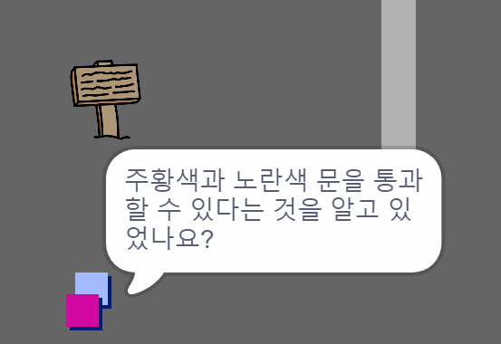

## 사람

`플레이어` 스프라이트와 상호작용하도록 사람을 추가합니다.

\--- task \---

`개인` 스프라이트로 전환합니다.


\--- /task \---

\--- task \---

`개인` 스프라이트에 코드를 추가해 `플레이어` 스프라이트에게 말을 하게 합니다. 이것은 `표지판` 스프라이트에 추가했던 코드와 매우 유사합니다:


```blocks3
깃발이 클릭되었을 때
x: (0) y: (-150) 으로 이동
무한반복
    만약 < 가 (플레이어 v) 에 닿는다면? > 이면
        [주황색과 노란색 문을 통과해 지나갈 수 있다는 걸 아셨나요?] 를 말합니다
    만약 아니라면
        [] 를 말합니다
    종료
종료
```

\--- /task \---

\--- task \---

코드의 `만약 아니라면` 섹션 내에 두개의 블록을 추가해 `개인` 스프라이트가 움직이게 해줍니다:


```blocks3
깃발이 클릭되었을 때
x: (0) y: (-150) 으로 이동
무한반복
    만약 < 가 (플레이어 v) 에 닿는다면? > 이면
        [주황색과 노란색 문을 통과해 지나갈 수 있다는 걸 아셨나요?] 를 말합니다
    만약 아니라면
        [] 를 말합니다
+       (1) 스텝 이동
+       가장자리에 닿으면, 튕기기
    종료
종료
```

\--- /task \---

이제 `개인` 스프라이트는 움직일 것이고 `플레이어` 스프라이트에 말을 걸 때는 멈출 것입니다.



\--- task \---

새로운 `개인` 스프라이트에 코드를 추가해 그것이 방1에서만 나타나게 합니다. 이에 필요한 코드는 `표지판` 스프라이트가 방1에서만 보이게 하는 코드와 정확히 일치합니다.

새 코드를 반드시 테스트하세요.

\--- /task \---