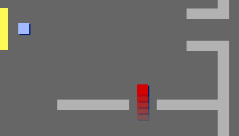

## Izazov: neprijatelji

If you want, you can also add patrolling enemies to your game. If the `player` sprite touches an enemy, the game ends.

+ Your game already contains an `enemy` sprite. Dodaj kôd liku `neprijatelja` tako da se pojavljuje samo u sobi 2.

+ Add code to move the `enemy` sprite and to end the game if the `enemy` sprite touches the `player` sprite. Ovo je lakše uraditi u odvojenim blokovima kôda. Ovako bi mogao da izgleda kôd tvog lika `neprijatelja`:

```blocks3
when flag clicked
forever
if <(room :: variables)=[2]> then
show
else
hide

when flag clicked
forever
if <touching (player v)?> then
stop [all v]

when flag clicked
go to x: (170) y:(0)
forever
repeat (130)
change x by (-1)
end
repeat (130)
change x by (1)
```

+ Isprobaj svoj lik `neprijatelja` da se uvjeriš u sljedeće: 
    + Da je vidljiv samo u sobi 2
    + Da patrolira po sobi
    + Da se igra završava ako ga lik `igrača` dodirne

Da li možeš u sobi 3 da kreiraš još jedan lik `neprijatelja` koji patrolira gore-dolje kroz otvor u zidu?

