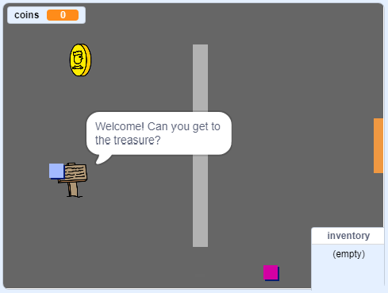

\--- no-print \---

ही प्रकल्पाची **Scratch 3** आवृत्ती आहे. प्रकल्पाची [Scratch 2 आवृत्ती देखील आहे](https://projects.raspberrypi.org/en/projects/create-your-own-world-scratch2).

\--- /no-print \---

## परिचय

या प्रकल्पात, आपण एक्सप्लोर करण्यासाठी अधिकाधिक लेवलसह आपले स्वतःचे साहसी गेम वर्ल्ड कसे तयार करावे ते शिकाल.

### आपण काय तयार करणार आहोत

\--- no-print \---

प्रारंभ करण्यासाठी हिरव्या ध्वजवर क्लिक करा. आपले कॅरॅक्टर(वर्ण) अवति-भोवतीच्या जगात फिरण्यासाठी एरो की(Arrow key) वापरा.

  <iframe allowtransparency="true" width="485" height="402" src="https://scratch.mit.edu/projects/embed/258757783/?autostart=false" frameborder="0" scrolling="no"></iframe>
  

\--- /no-print \---

\--- print-only \---

आपले कॅरॅक्टर ओवति-भोवतीच्या जगात फिरण्यासाठी एरो की(Arrow key) वापराल. 

\--- /print-only \---

## \--- collapse \---

## title: आपल्याला कशाची आवश्यकता लागेल

### हार्डवेअर

- Scratch 3 चालवण्यास सक्षम असलेले संगणक

### सॉफ्टवेअर

- Scratch 3 (एकतर [ऑनलाइन](http://rpf.io/scratchon){:target="_blank"} किंवा [ऑफलाइन](http://rpf.io/scratchoff){:target="_blank"})

### डाउनलोड्स

हा प्रकल्प पूर्ण करण्यासाठी आपल्याला आवश्यक असलेली प्रत्येक गोष्ट आपण [rpf.io/p/en/create-your-own-world-go](https://rpf.io/p/en/create-your-own-world-go) वर शोधू शकता.

\--- /collapse \---

## \--- collapse \---

## title: आपण काय शिकणार

- बटण दाबल्यावर प्रतिक्रिया मिळण्यासाठी conditional selection वापरा
- गेमची स्थिती गोळा करण्यासाठी चल (variable) वापरा
- चलच्या मूल्यानूसार conditional selection वापरा
- डेटा संग्रहित करण्यासाठी यादी(lists) वापरा

\--- /collapse \---

## \--- collapse \---

## title: शिक्षकांसाठी अतिरिक्त माहिती

तुम्हाला हा प्रोजेक्ट प्रिंट करणे आवश्यक असल्यास, कृपया [प्रिन्टर अनुकूल आवृत्ती](https://projects.raspberrypi.org/en/projects/create-your-own-world/print){:target="_blank"} वापरा.

आपण येथे [पूर्ण केलेला प्रोजेक्ट](https://rpf.io/p/en/create-your-own-world-get){:target="_blank"} शोधू शकता.

\--- /collapse \---