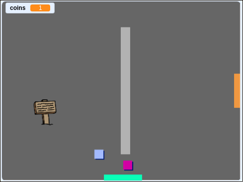

## आव्हान: तुमचे जग वाढवा

आपण आता आपले स्वतःचे जग तयार करणे सुरू ठेवू शकता! येथे काही कल्पना आहेत:

+ आपल्या गेममध्ये वेगवेगळ्या रूममध्ये आणखी नाणी जोडा. गस्त घालणाऱ्या शत्रूद्वारे काही नाण्यांचे रक्षण करू शकता का?
+ आपल्या गेमची बॅकड्रॉप्स बदला
+ आपल्या गेममध्ये ध्वनी आणि संगीत जोडा
+ अधिक लोक, शत्रू आणि चिन्हे जोडा
+ लाल आणि पिवळे दारे आणि ती उघडण्यासाठी खास चाबी जोडा
+ आपल्या प्रकल्पात अधिक रूम जोडा
+ आपल्या गेममध्ये इतर उपयुक्त गोष्टी जोडा
    
    + इतर लोकांकडून माहिती मिळवण्यासाठी नाणी वापरा:


+ आपण रूम 1 च्या उत्तरेकडे व दक्षिणेकडील भिंतींमध्ये दरवाजे देखील जोडू शकता, जेणेकरून खेळाडू चारही दिशांमध्ये रूममध्ये फिरू शकेल. उदाहरणार्थ, आपल्या गेममध्ये 3 × 3 ग्रिडमध्ये नऊ खोल्या असू शकतात. एका पातळीवर खाली जाण्यासाठी रूमच्या क्रमांकावरआपण `3` जोडू शकता.




```blocks3
if <touching color [ ]?> then
switch backdrop to ((costume [number v]) + (3))
go to x:(0) y:(200)
change [room v] by (3)
```