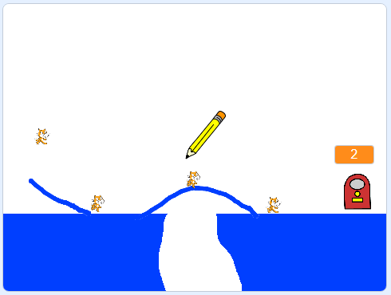

## पुढे काय?

[CATS!](https://projects.raspberrypi.org/mr-IN/projects/cats?utm_source=pathway&utm_medium=whatnext&utm_campaign=projects) चा वापर करून दुसरा गेम तयार करुन पहा.

--- no-print ---

पेन्सिलने रेखा काढण्यासाठी माउस क्लिक करून ड्रॅग करा. बाहेर जाण्यासाठी सुरक्षित मार्ग तयार करून मांजरींना गड्ड्यामध्ये पडण्यापासून रोखण्याचे आपले लक्ष्य आहे.

  <iframe allowtransparency="true" width="485" height="402" src="https://scratch.mit.edu/projects/embed/253667883/?autostart=false" frameborder="0" scrolling="no"></iframe>

--- /no-print ---

--- print-only ---

--- /print-only ---

आपल्याला Scratch ऐवजी Python चा वापर करुन एखादा गेम करायचा असल्यास, [RPG](https://projects.raspberrypi.org/mr-IN/projects/rpg?utm_source=pathway&utm_medium=whatnext&utm_campaign=projects) प्रकल्प वापरून पहा.

***
या प्रकल्पाचे भाषांतर स्वयंसेवकांनी केले:

Prajakta Tarale

Apurwa

स्वयंसेवकांचे आभार, आम्ही जगभरातील लोकांना त्यांच्या भाषेतून शिकण्याची संधी देऊ शकतो. आपण आम्हाला भाषांतर करण्यासाठी स्वयंसेवा करून अधिक लोकांपर्यंत पोहोचण्यास मदत करू शकता - अधिक माहिती [rpf.io/translate](https://rpf.io/translate) वर.