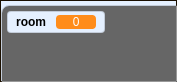

## तुमच्या गेमच्या जगात फिरा

आपला `player` sprite हा इतर खोल्यांमध्ये दारातुन फिरण्यास सक्षम असावा.

आपल्या प्रकल्पात अतिरिक्त खोल्यांसाठी बॅकड्रॉप्स आहेत:


\--- task \---

व्हेरिएबल 'for all sprites' साठी `room`{:class="block3variables"} नावाचे एक नवीन व्हेरिएबल्स तयार करा जेणेकरून `player` sprite कोणत्या खोलीत आहे याचा मागोवा ठेवता येईल.

[[[generic-scratch3-add-variable]]]



\--- /task \---

\--- task \---

जेव्हा `player` sprite पहिल्या खोलीत नारिंगीच्या दाराला स्पर्श करते, तेव्हा पुढील पार्श्वभूमी दिसली पाहिजे आणि `player` sprite स्टेजच्या डाव्या बाजूस परत सरकली पाहिजे. `player` sprite's मध्ये `forever`{:class="block3control"} loop हा कोड जोडा:


```blocks3
when flag clicked
forever
    if <key (up arrow v) pressed? > then
        point in direction (0)
        move (4) steps
    end
    if <key (left arrow v) pressed? > then
        point in direction (-90)
        move (4) steps
    end
        if <key (down arrow v) pressed? > then
        point in direction (180)
        move (4) steps
    end
        if <key [right arrow v] pressed? > then
        point in direction (90)
        move (4) steps
    end
    if < touching color [#BABABA]? > then
    move (-4) steps
    end
+   if < touching color [#F2A24A] > then
    switch backdrop to (next backdrop v)
    go to x: (-200) y: (0)
    change [room v] by (1)
    end
end
```

\--- /task \---

\--- task \---

प्रत्येक वेळी गेम सुरू होताच खोली, वर्णांची स्थिती आणि पार्श्वभूमी रीसेट करणे आवश्यक असते.

ध्वज क्लिक केल्यावर सर्वकाही रीसेट करण्यासाठी **सुरवातीला** `player` sprite च्या वर `forever`{:class="block3control"} loop मधे कोड जोडा:

\--- hints \---

\--- hint \---

गेम सुरू झाल्यावर:

+ `room`{:class="block3variables"} चे मूल्य `1`{:class="block3variables"} वर सेट करा
+ `backdrop`{:class="block3looks"} `room1`{:class="block3looks"} वर सेट करा
+ `player` sprite ची स्थिती `x: -200 y: 0`{:class="block3motion"} वर सेट केली जावी

\--- /hint \---

\--- hint \---

आपल्याला आवश्यक असलेले ब्लॉक येथे आहेत:


```blocks3
go to x: (-200) y: (0)

set [room v] to (1)

switch backdrop to (room1 v)
```

\--- /hint \---

\--- hint \---

आपली पूर्ण झालेली स्क्रिप्ट कशी दिसावी हे येथे आहे:


```blocks3
when flag clicked
+set [room v] to (1)
+go to x: (-200) y: (0)
+switch backdrop to (room1 v)
forever
    if <key (up arrow v) pressed? > then
        point in direction (0)
        move (4) steps
    end
    if <key (left arrow v) pressed? > then
        point in direction (-90)
        move (4) steps
    end
        if <key (down arrow v) pressed? > then
        point in direction (180)
        move (4) steps
    end
        if <key [right arrow v] pressed? > then
        point in direction (90)
        move (4) steps
    end
    if < touching color [#BABABA]? > then
    move (-4) steps
    end
    if < touching color [#F2A24A] > then
    switch backdrop to (next backdrop v)
    go to x: (-200) y: (0)
    change [room v] by (1)
end
end
```

\--- /hint \---

\--- /hints \---

\--- /task \---

\--- task \---

ध्वज क्लिक करा आणि नंतर आपल्या `player` sprite ला तो केशरी दाराला स्पर्श करेपर्यंत हलवा. तुमचा sprite पुढील स्क्रीनवर हलतोय का? `room`{:class="block3variables"}चल `2` मध्ये बदलू शकते का?


\--- /task \---