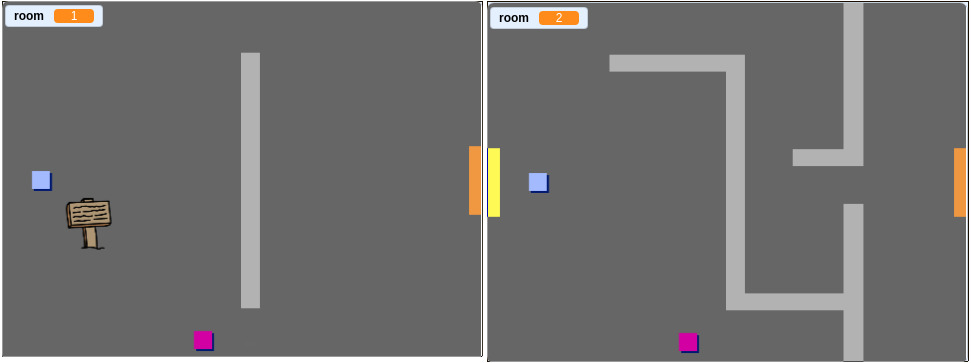

## चिन्हे

आता खेळाडूंना त्यांच्या प्रवासासाठी मार्गदर्शन करण्यासाठी तुमच्या गेममधे चिन्हे जोडा.

तुमच्या प्रकल्पात `welcome sign` sprite असे चिन्हे दिसतील:


--- task ---

`welcome sign` sprite केवळ room(रूम) 1 मध्येच दिसले पाहिजे, हे घडण्यासाठी sprite मधे अधिक कोड जोडा:

--- hints ---


--- hint ---

जेव्हा `When the flag is clicked`{:class="block3events"} क्लीक केला जाईल `forever`{:class="block3control"} loop च्या आतला चेक करेल `if`{:class="block3control"} `room is 1`{:class="block3variables"} असेल तेव्हा `show`{:class="block3looks"} `welcome sign` sprite दाखवेल नाहीतर `else`{:class="block3control"} `hide`{:class="block3looks"} sprite दाखवेल.

--- /hint ---

--- hint ---

आपल्याला आवश्यक असलेले ब्लॉक येथे आहेत:


```blocks3
if < > then
else
end

< (room :: variables) = [1] >

hide

show

forever
end

when flag clicked

```

--- /hint ---

--- hint ---

येथे पूर्ण कोड आहे:


```blocks3
when flag clicked
forever
    if < (room :: variables) = [1] > then
        show
    else
        hide
    end
end
```

--- /hint ---

--- /hints ---

--- /task ---

--- task ---

आपल्या `welcome sign` कोडची चाचणी करून घ्या room मध्ये sprite ला फिरवून. चिन्ह(sign) फक्त रूम 1 मध्ये दिसले पाहिजे.



--- /task ---

--- task ---

चिन्ह काहीच बोलले नाही तर जास्त चांगले नाही! जेव्हा `welcome sign` sprite `player` sprite ला स्पर्श करेल तेव्हा एक संदेश दिसला पाहिजे त्यासाठी अजून कोड जोडा:


```blocks3
when flag clicked
forever
if < (room :: variables) = [1] > then
show
else
hide
end
+if < touching (player v)? > then
say [Welcome! Can you get to the treasure?]
else
say []
end
end
```

--- /task ---

--- task ---

आपल्या `welcome sign` sprite ची परत एकदा चाचणी करून घ्या. जेव्हा `player` sprite `welcome sign` sprite ला स्पर्श करेल तेव्हा एक संदेश दिसेल.


--- /task ---