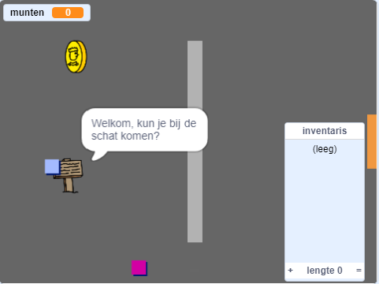

\--- no-print \---

Dit is de **Scratch 3** versie van het project. Er is ook een [Scratch 2 versie van dit project](https://projects.raspberrypi.org/en/projects/create-your-own-world-scratch2).

\--- /no-print \---

## Inleiding

In dit project leer je hoe je je eigen avonturen-spelwereld kunt maken met meerdere niveaus om te verkennen.

### Wat ga je maken

\--- no-print \---

Klik op de groene vlag om te starten. Gebruik de pijltjestoetsen om je spelfiguur in de wereld rond te bewegen.

  <iframe allowtransparency="true" width="485" height="402" src="https://scratch.mit.edu/projects/embed/258757783/?autostart=false" frameborder="0" scrolling="no"></iframe>
  

\--- /no-print \---

\--- print-only \---

Je gebruikt de pijltjestoetsen om je karakter in de wereld te verplaatsen. 

\--- /print-only \---

## \--- collapse \---

## title: Wat heb je nodig

### Hardware

- Een computer die Scratch 3 kan uitvoeren

### Software

- Scratch 3 (of [online](http://rpf.io/scratchon){:target="_blank"} of [offline](http://rpf.io/scratchoff){:Target="_blank"})

### Downloads

Je kunt alles wat je nodig hebt om dit project te voltooien vinden op [rpf.io/p/en/create-your-own-world-go ](https://rpf.io/p/en/create-your-own-world-go).

\--- /collapse \---

## \--- collapse \---

## title: Wat ga je leren

- Gebruik voorwaardelijke selectie om te reageren op toetsaanslagen
- Gebruik variabelen om de status van een spel op te slaan
- Gebruik voorwaardelijke selectie op basis van de waarde van een variabele
- Gebruik lijsten om gegevens op te slaan

\--- /collapse \---

## \--- collapse \---

## title: Aanvullende informatie voor docenten

Als je dit project wilt afdrukken, gebruik dan de [ printvriendelijke versie ](https://projects.raspberrypi.org/en/projects/create-your-own-world/print) {:target="_ blank"}.

You can find the [completed project here](https://rpf.io/p/en/create-your-own-world-get){:target="_blank"}.

\--- /collapse \---