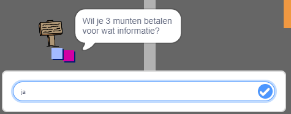
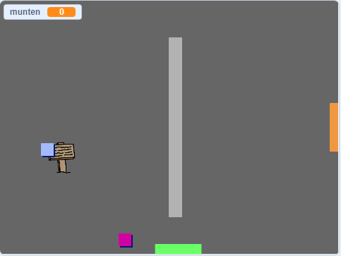

## Uitdaging: vergroot je wereld

Je kunt nu doorgaan met het maken van je eigen wereld! Hier zijn wat ideeën:

+ Voeg meer munten in verschillende kamers toe aan je spel. Kun je sommige munten laten bewaken door patrouillerende vijanden?
+ Verander de achtergronden van je spel
+ Voeg geluid en muziek toe aan je spel
+ Voeg meer mensen, vijanden en borden toe
+ Voeg rode en gele deuren toe en speciale sleutels om ze te openen
+ Voeg meer kamers toe aan je wereld
+ Voeg andere nuttige dingen toe aan je spel
    
    + Gebruik munten om informatie van andere personen te krijgen:



+ Je zou zelfs deuren kunnen toevoegen aan de noord- en zuidwanden van kamer 1, zodat de speler in alle vier de richtingen door kamers kan lopen. Je game kan bijvoorbeeld negen kamers hebben in een raster van 3 × 3. Je kunt dan `3` optellen bij het kamernummer om naar een ​​niveau lager te gaan.

 

```blocks3
als <touching color [ ]?> dan 
 verander achtergrond naar ((uiterlijk [number v]) + (3):: operators):: looks
 ga naar x: (0) y: (200):: motion
 verander [kamer v] met (3):: variables:: control
end
```