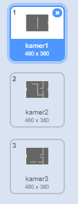
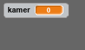
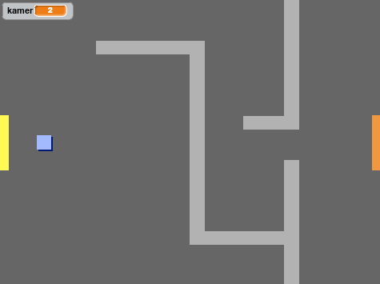

## Verplaats je door je wereld

De `speler` sprite zou door deuren naar andere kamers moeten kunnen lopen.

Het project bevat achtergronden voor extra kamers:



\--- task \---

Maak een nieuwe variabele 'voor alle sprites' met de naam `kamer`{:class="block3variables"} om bij te houden in welke kamer de `speler` sprite zich bevindt.

[[[generic-scratch3-add-variable]]]



\--- /task \---

\--- task \---

When the `player` sprite touches the orange door in the first room, the game should display the next backdrop, and the `player` sprite should move back to the left side of the Stage. Add this code inside the `player` sprite's `forever`{:class="block3control"} loop:


```blocks3
wanneer groene vlag wordt aangeklikt
herhaal 
  als <toets (pijltje omhoog v) ingedrukt? > dan
            richt naar (0) graden
            neem (4) stappen
        einde
        als <toets (pijltje links v) ingedrukt? > dan
            richt naar (-90) graden
            neem (4) stappen
      einde
        als <toets (pijltje omlaag v) ingedrukt? > dan
            richt naar (-180) graden
            neem (4) stappen
        einde
        als <toets (pijltje rechts v) ingedrukt? > dan
            richt naar (90) graden
            neem (4) stappen
        einde
        als < raak ik kleur [#BABABA]? > dan
    neem (-4) stappen
    einde
+ als < raak ik kleur [#F2A24A] > dan
    verander achtergrond naar (volgende achtergrond v)
    ga naar x: (-200) y: (0)
    verander [kamer v] met (1)
    einde
einde
```

\--- /task \---

\--- task \---

Every time the game starts, the room, character position, and backdrop need to be reset.

Add code to the **start** of your `player` sprite code above the `forever`{:class="block3control"} loop, to reset everything when the flag is clicked:

\--- hints \---

\--- hint \---

When the game starts:

+ De waarde van `kamer`{:class="block3variables"} moet zijn ingesteld op `1`{:class="block3variables"}
+ De `achtergrond`{:class="block3looks"} moet zijn ingesteld op `kamer1`{:class="block3looks"}
+ The position of the `player` sprite should be set to `x: -200 y: 0`{:class="block3motion"}

\--- /hint \---

\--- hint \---

Here are the extra blocks you need:


```blocks3
ga naar x: (-200) y: (0)

maak [kamer v] (1)

verander achtergrond naar (kamer1 v)
```

\--- /hint \---

\--- hint \---

Here's what your finished script should look like:


```blocks3
wanneer groene vlag wordt aangeklikt
+ maak [kamer v] (1)
+ ga naar x: (-200) y: (0)
+ verander achtergrond naar (kamer1 v)
herhaal
    als <toets (pijltje omhoog v) ingedrukt? > dan
            richt naar (0) graden
            neem (4) stappen
        einde
        als <toets (pijltje links v) ingedrukt? > dan
            richt naar (-90) graden
            neem (4) stappen
      einde
        als <toets (pijltje omlaag v) ingedrukt? > dan
            richt naar (-180) graden
            neem (4) stappen
        einde
        als <toets (pijltje rechts v) ingedrukt? > dan
            richt naar (90) graden
            neem (4) stappen
        einde
        als < raak ik kleur [#BABABA]? > dan
    zet (-4) stappen
    einde
   als < raak ik kleur [#F2A24A] > dan
    verander achtergrond naar (volgende achtergrond v)
    ga naar x: (-200) y: (0)
    verander [kamer v] met (1)
    einde
einde
```

\--- /hint \---

\--- /hints \---

\--- /task \---

\--- task \---

Click the flag, and then move your `player` sprite until it touches the orange door. Does the sprite move to the next screen? Does the `room`{:class="block3variables"} variable change to `2`?



\--- /task \---