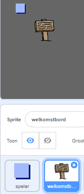
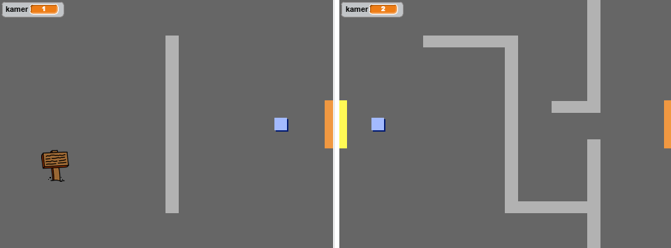
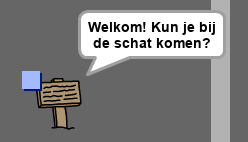

## Borden

Laten we borden aan je wereld toevoegen om de speler op zijn reis te begeleiden.

Je project bevat een sprite `welkomstbord`:



\---task\--- De `Welkomstbord` sprite moet alleen zichtbaar zijn in kamer 1, dus voeg code aan de sprite toe om ervoor te zorgen dat dit gebeurt:

\--- hints \--- \--- hint \--- `Wanneer op de groene vlag wordt geklikt`{:class="block3events"}, in een `herhaal` {:class="block3control"} lus, controleer `als`{:class="block3control"} de `kamer 1 is`{:class="block3variables"} en activeer in dat geval `verschijn`{:class="block3looks"} van de `welkomstbord` sprite, `anders`{:class="block3control"} `verdwijn` {:class="block3looks"} van de sprite. \--- /hint \--- \--- hint \--- Dit zijn de codeblokken die je nodig hebt:


```blocks3
<br />als &lt; &gt; dan
anders
einde

&lt; (kamer:: variables) = [1] &gt;

verdwijn

verschijn

herhaal
einde

wanneer groene vlag wordt aangeklikt

```

\--- / hint \--- \--- hint \--- Dit is de complete code die je moet toevoegen:


```blocks3
wanneer groene vlag wordt aangeklikt
herhaal
    als< (kamer :: variables) = [1] > dan
        verschijn
    anders
        verdwijn
    einde
einde
```

\--- /hint \--- \--- /hints \---

\--- /task \---

\--- taak \--- Test de code voor je `welkomstbord` sprite door tussen kamers te bewegen. Het bord mag alleen zichtbaar zijn in kamer 1.

 -- /task \---

\--- task \--- Een bord is niet veel waard als het niets zegt! Voeg code toe om een bericht weer te geven als de sprite `welkomstbord` wordt aangeraakt door de sprite `speler`:


```blocks3
wanneer groene vlag wordt aangeklikt
herhaal 
 als < (kamer :: variables) = [1] > dan 
 verschijn
 anders 
 verdwijn
 einde
+als < raak ik (speler v)? > dan
zeg [Welkom! Kun je bij de schat komen?]
anders
zeg []
end
end
```

\--- /task \---

\--- task \--- Test je `welkomstbord` sprite opnieuw. Je zou nu een bericht moeten zien wanneer de `speler` sprite de `welkomstbord` sprite raakt.

 \--- /task \---