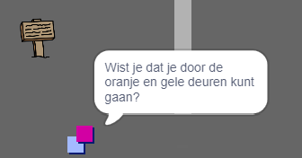

## Personen

Laten we andere personen aan je wereld toevoegen waarmee de `speler` sprite kan communiceren.

\--- task \---

Switch to the `person` sprite.


\--- /task \---

\--- task \---

Add some code to the `person` sprite so that the person talks to the `player` sprite. This code is very similar to the code you added to your `sign` sprite:


```blocks3
wanneer groene vlag wordt aangeklikt
ga naar x: (0) y: (-150)
herhaal 
  als < raak ik (speler v)? > dan 
    zeg [Wist je dat je door de oranje en gele deuren kunt gaan?]
  anders
    zeg []
  einde
einde
```

\--- /task \---

\--- task \---

Allow your `person` sprite to move by adding these two blocks in the `else`{:class="block3control"} section of your code:


```blocks3
wanneer groene vlag wordt aangeklikt
ga naar x: (0) y: (-150)
herhaal 
  als <raak ik (speler v)?> dan  > dan 
    zeg [Wist je dat je door de oranje en gele deuren kunt gaan?]
  anders
    zeg []
+   neem (1) stappen
+   keer om aan de rand
  einde
einde
```

\--- /task \---

Your `person` sprite will now move, but will stop to talk to the `player` sprite.



\--- task \---

Add code to your new `person` sprite so that the sprite only appears in room 1. The code you need is exactly the same as the code that makes the `sign` sprite only visible in room 1.

Make sure you test out your new code.

\--- /task \---