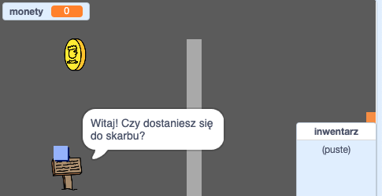

\--- no-print \---

To jest wersja projektu korzystająca z **Scratch 3**. Istnieje również [wersja tego projektu dla Scratch 2](https://projects.raspberrypi.org/en/projects/create-your-own-world-scratch2).

\--- /no-print \---

## Wprowadzenie

W tym projekcie nauczysz się tworzyć własny świat gier przygodowych z wieloma poziomami do odkrycia.

### Co będziesz robił

\--- no-print \---

Kliknij na zieloną flagę, aby rozpocząć. Użyj klawiszy strzałek, aby poruszać swoją postać w świecie gry.

  <iframe allowtransparency="true" width="485" height="402" src="https://scratch.mit.edu/projects/embed/258757783/?autostart=false" frameborder="0" scrolling="no"></iframe>
  

\--- /no-print \---

\--- print-only \---

Użyjesz klawiszy strzałek, aby przenieść swoją postać na całym świecie. 

\--- /print-only \---

## \--- collapse \---

## title: Czego będziesz potrzebować

### Sprzęt

- Komputer, na którym można uruchomić Scratch 3

### Oprogramowanie

- Scratch 3 ([online](http://rpf.io/scratchon){:target="_blank"} lub [offline](http://rpf.io/scratchoff){:target="_blank"})

### Pobrane

Możesz znaleźć wszystko, czego potrzebujesz, aby ukończyć ten projekt na [rpf.io/p/en/create-your-own-world-go](https://rpf.io/p/en/create-your-own-world-go).

\--- /collapse \---

## \--- collapse \---

## title: Czego się nauczysz

- Użyj wyboru warunkowego, aby zareagować na naciśnięcia przycisków
- Użyj zmiennych do przechowywania stanu gry
- Użyj wyboru warunkowego na podstawie wartości zmiennej
- Używaj list do przechowywania danych

\--- /collapse \---

## \--- collapse \---

## title: Dodatkowe informacje dla nauczycieli

Jeśli chcesz wydrukować ten projekt, użyj [wersji do druku](https://projects.raspberrypi.org/en/projects/create-your-own-world/print){:target="_blank"}.

You can find the [completed project here](https://rpf.io/p/en/create-your-own-world-get){:target="_blank"}.

\--- /collapse \---