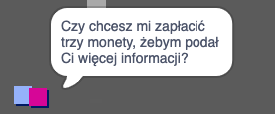
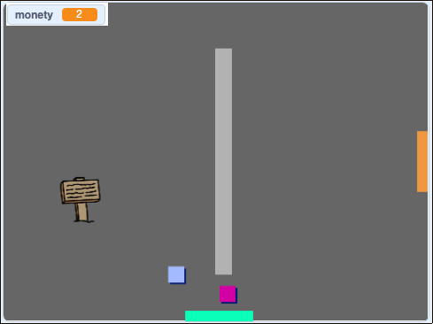

## Wyzwanie: rozwiń swój świat

Możesz teraz kontynuować tworzenie własnego świata! Oto kilka pomysłów:

+ Dodaj więcej monet do gry w różnych pokojach. Może część z nich będzie strzeżona przez patrol wrogów?
+ Zmień tła swojej gry
+ Dodaj dźwięk i muzykę do swojej gry
+ Dodaj więcej osób, wrogów i znaków
+ Dodaj czerwone i żółte drzwi oraz specjalne klucze, aby je otworzyć
+ Dodaj więcej pokoi do swojego projektu
+ Dodaj inne przydatne przedmioty do swojej gry
    
    + Użyj monet, aby uzyskać informacje od innych postaci:



+ Możesz nawet dodać drzwi w północnej i południowej ścianie pokoju 1, aby gracz mógł poruszać się między pokojami we wszystkich czterech kierunkach. Na przykład Twoja gra może mieć dziewięć pomieszczeń w siatce 3 × 3. Następnie możesz dodać `3` do numeru pokoju, aby przejść o jeden poziom niżej.

 

```blocks3
jeżeli <dotyka koloru [ ]?> to 
zmień tło na ((kostium [liczba v]) + (3))
Idź do x: (0) y: (200)
zmień [pokój v] o (3)
koniec
```