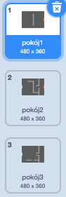
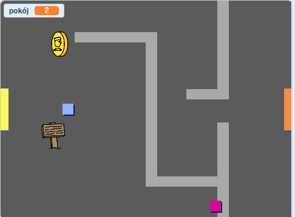

## Poruszaj się po swoim świecie

Duszek `gracza` powinien móc przejść przez drzwi do innych pomieszczeń.

Twój projekt zawiera tła dla dodatkowych pokoi:



\--- task \---

Utwórz nową zmienną 'dla wszystkich duszków' o nazwie `pokój`{:class="block3variables"}, aby śledzić w którym pomieszczeniu znajduje się duszek `gracza`.

[[[generic-scratch3-add-variable]]]

 \--- /task \---

\--- task \--- Kiedy duszek `gracz` dotknie pomarańczowych drzwi w pierwszym pomieszczeniu, kolejne tło powinno być wyświetlone, a duszek `gracz` powinien wrócić na lewą stronę sceny. Dodaj ten kod dla duszka `gracza` wewnątrz pętli `zawsze`{:class="block3control"}:


```blocks3
kiedy kliknięto zieloną flagę
zawsze 
    jeżeli <klawisz (strzałka w górę v) naciśnięty? > to
        ustaw kierunek na (0)
        przesuń o (4) kroki
    koniec
    jeżeli <klawisz (strzałka w lewo v) naciśnięty? > to
        ustaw kierunek na (-90)
        przesuń o (4) kroki
    koniec
        jeżeli <klawisz (strzałka w dół v) naciśnięty? > to
        ustaw kierunek na (-180)
        przesuń o (4) kroki
    koniec
        jeżeli <klawisz [strzałka w prawo v] naciśnięty? > to
        ustaw kierunek na (90)
        przesuń o (4) kroki
    koniec
    jeżeli < dotyka koloru [#BABABA]? > to
    przesuń o (-4) kroki
    koniec
+   jeżeli < dotyka koloru [#F2A24A] > to
    przełącz tło na (następne tło v)
    idź do x: (-200) y: (0)
    zmień [pokój v] o (1)
    koniec
koniec
```

\--- /task \---

\--- task \--- Za każdym razem, gdy gra się rozpoczyna, pokój, pozycja postaci i tło muszą być resetowane.

Dodaj ten kod na **początku** kodu twojego duszka `gracza` powyżej pętli `zawsze`{:class="block3control"}, aby zresetować wszystko po kliknięciu flagi:

\--- hints \--- \--- hint \--- Kiedy gra się rozpoczyna:

+ Wartość zmiennej `pokój`{:class="block3variables"} powinna być ustawiona na `1`{:class="block3variables"}
+ `Tło`{:class="block3looks"} powinno być ustawione na `pokój1`{:class="block3looks"}
+ Pozycja duszka `gracz` powinna być ustawiona na `x: -200 y: 0`{:class="block3motion"} \--- /hint \--- \--- hint \--- Tutaj są dodatkowe bloki, których potrzebujesz:


```blocks3
idź do x: (-200) y: (0)

ustaw [pokój v] na (1)

przełącz tło na (pokój1 v)
```

\--- /hint \--- \--- hint \--- Oto, jak powinien wyglądać ukończony skrypt:


```blocks3
kiedy kliknięto zieloną flagę
+ustaw [pokój v] na (1)
+Idź do x: (-200) y: (0)
+zmień tło na (pokój1 v)
zawsze 
    jeżeli <klawisz (strzałka w górę v) naciśnięty? > to
        ustaw kierunek na (0)
        przesuń o (4) kroki
    koniec
    jeżeli <klawisz (lewa strzałka v) naciśnięty? > to
        ustaw kierunek na (-90)
        przesuń o (4) kroki
    koniec
        jeżeli <klawisz (strzałka w dół v) naciśnięty? > to
        ustaw kierunek na (-180)
        przesuń o (4) kroki
    koniec
        jeżeli <klawisz [strzałka w prawo v] naciśnięty? > to
        ustaw kierunek na (90)
        przesuń o (4) kroki
    koniec
    jeżeli < dotyka koloru [#BABABA]? > to
    przesuń o (-4) kroki
    koniec
    jeżeli < dotyka koloru [#F2A24A] > to
    przełącz tło na (następne tło v)
    idź do x: (-200) y: (0)
    zmień [pokój v] o (1)
    koniec
koniec
```

-- /hint \--- \--- hints \---

\--- /task \---

\--- task \--- Kliknij flagę, a następnie przesuń swój duszek `gracza`, aż dotknie pomarańczowych drzwi. Czy duszek przechodzi do następnego ekranu? Czy zmienna `pokój`{:class="block3variables"} zmienia się na `2`?

 \--- /task \---