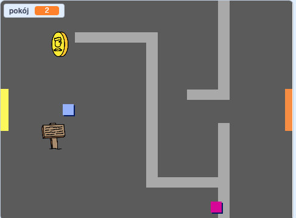

## Oprogramuj swój świat

Pozwólmy duszkowi `gracza` przechodzić przez drzwi do innych pomieszczeń.

Twój projekt zawiera tła dla dodatkowych pokoi:


+ Utwórz nową zmienną 'dla wszystkich duszków' o nazwie `pokój`{:class="blockdata"}, aby śledzić w którym pomieszczeniu znajduje się duszek `gracza`.

[[[generic-scratch-add-variable]]]


+ Kiedy duszek `gracza` dotknie pomarańczowych drzwi w pierwszym pomieszczeniu, kolejne tło powinno być wyświetlone, a duszek `gracza` powinien wrócić na lewą stronę sceny. Dodaj ten kod do duszka `gracza` wewnątrz pętli `zawsze`{:class="blockcontrol"}:

```blocks
    if < touching color [#F2A24A] > then
        switch backdrop to [next backdrop v]
        go to x: (-200) y: (0)
        change [room v] by (1)
    end
```

+ Add this code to the **start** of your `player` sprite code (above the `forever`{:class="blockcontrol"} loop) to make sure that everything is reset when the flag is clicked:
    
    ```blocks
        set [room v] to (1)
        go to x: (-200) y: (0)
        switch backdrop to [room1 v]
    ```

+ Click the flag and move your `player` sprite over the orange door. Does your sprite move to the next screen? Does the `room`{:class="blockdata"} variable change to `2`?



\--- challenge \---

### Challenge: moving to the previous room

+ Can you make your `player` sprite move to the previous room when they touch a yellow door? The code you need for this is very similar to the code you've already added for moving to the next room.

\--- /challenge \---