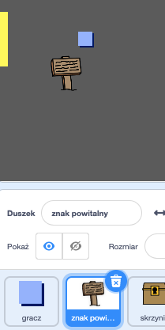
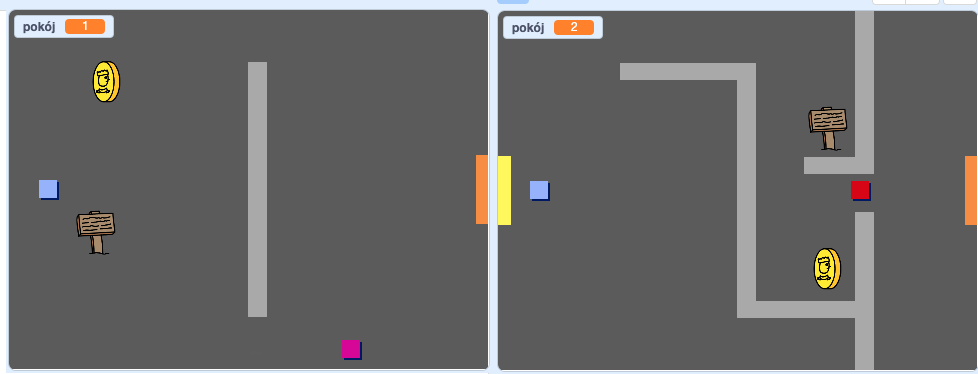
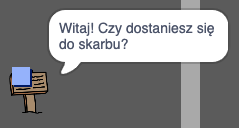

## Znaki

Teraz dodaj znaki do swojego świata, aby poprowadzić graczy w ich podróży.

Twój projekt zawiera duszka `znak-powitanie`:



\--- task \--- Duszek `Znak-powitanie` powinien być widoczny tylko w pokoju 1, więc dodaj trochę kodu do duszka, aby upewnić się, że tak się stanie:

\--- hints \--- \--- hint \--- `kiedy kliknięto zieloną flagę`{:class="block3events"}, w pętli `zawsze`{:class="block3control"}, sprawdź `jeżeli`{:class="block3control"} `pokój to 1`{:class="block3variables"} to wtedy `pokaż`{:class="block3looks"} duszka `znak-powitanie`, `w przeciwnym razie`{:class="block3control"} `ukryj`{:class="block3looks"} tego duszka. \--- /hint \--- \--- hint \--- Oto bloki, których potrzebujesz:


```blocks3
<br />jeżelili &lt; &gt; to
w przeciwnym razie
koniec

&lt; (pokój :: zmienne) = [1] &gt;

ukryj

pokaż

zawsze
koniec

kiedy kliknięto zieloną flagę

```

\--- /hint \--- \--- hint \--- Oto pełny kod:


```blocks3
kiedy kliknięto zieloną flagę
zawsze
    jeżeli < (pokój :: zmienne) = [1] > to
        pokaż
    w przeciwnym razie
        ukryj
    koniec
koniec
```

-- /hint \--- \--- hints \---

\--- /task \---

\--- task \--- Przetestuj kod dla swojego duszka `znaku-powitania`, przechodząc między pokojami. Znak powinien być widoczny tylko w pokoju 1.

 \--- /task \---

\--- task \--- Znak nie jest zbytnio przydatny, jeśli nic nie mówi! Dodaj więcej kodu, aby wyświetlić wiadomość, jeśli duszek `znak-powitanie` dotyka duszka `gracz`:


```blocks3
kiedy kliknięto zieloną flagę
zawsze
jeżli < (pokój :: zmienne) = [1] > to
pokaż
w przeciwnym razie
ukryj
koniec
+ jeżeli < dotyka (gracz v)? > to
powiedz [Witamy! Czy uda Ci się dotrzeć do skarbu?]
w przeciwnym razie
powiedz []
koniec
koniec
```

\--- /task \---

\--- task \--- Ponownie przetestuj swojego duszka `znak-powitania`. Teraz powinieneś zobaczyć komunikat, gdy duszek `gracza` dotyka duszka `znak-powitalny`.

 \--- /task \---