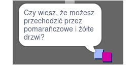

## Postacie

Dodaj do swojego świata inne osoby, z którymi twój duszek `gracz` może wchodzić w interakcje.

\--- task \--- Przejdź do duszka `osoba`.

 \--- /task \---

\--- task \--- Dodaj trochę kodu do duszka `osoba`, aby ta osoba rozmawiała z duszkiem `gracz`. Ten kod jest bardzo podobny do kodu dodanego do duszka `znak powitalny`:


```blocks3
kiedy kliknięto zieloną flagę
    idź do x: (0) y: (-150)
    zawsze 
        jeżeli < dotyka (gracz v)? > to
        powiedz [Czy wiesz, że możesz przechodzić przez pomarańczowe i żółte drzwi?]
    w przeciwnym razie
        powiedz []
    koniec
koniec
```

\--- /task \---

\--- task \--- Pozwól swojemu duszkowi `osoby` poruszać się, przez dodanie tych dwóch bloków w sekcji kodu `w przeciwnym razie`{:class = „block3control”}:


```blocks3
kiedy kliknięto zieloną flagę
    idź do x: (0) y: (-150)
    zawsze 
        jeżeli < dotyka (gracz v)? > to
        powiedz [Czy wiesz, że możesz przechodzić przez pomarańczowe i żółte drzwi?]
    w przeciwnym razie
        powiedz []
+       przesuń o (1) kroki
+       jeżeli na krawędzi, odbij się
    koniec
koniec

```

\--- /task \---

Twój duszek `osoba` będzie się teraz poruszać, ale zatrzyma się aby porozmawiać z duszkiem `gracz`.



\--- task \--- Dodaj kod do nowego duszka `osoba` tak, aby ten duszek pojawił się tylko w pokoju 1. Kod, którego potrzebujesz, jest dokładnie taki sam jak kod, który sprawia, że duszek `znak powitalny` widoczny tylko w pokoju 1.

Pamiętaj o przetestowaniu swojego nowego kodu. \--- /task \---