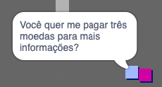
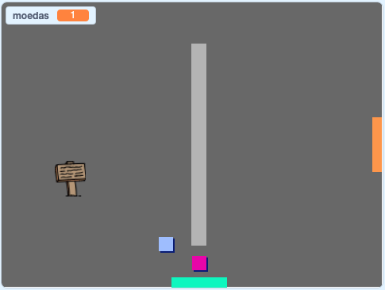

## Desafio: amplie seu mundo

Agora você pode continuar criando seu próprio mundo! Aqui estão algumas idéias:

+ Adicione mais moedas ao seu jogo em diferentes salas. Você pode deixar algumas moedas serem protegidas por patrulhamento de inimigos?
+ Mude os antecedentes do seu jogo
+ Adicione som e música ao seu jogo
+ Adicione mais pessoas, inimigos e sinais
+ Adicione portas vermelhas e amarelas e chaves especiais para abri-las
+ Adicione mais salas ao seu mundo
+ Adicione outros itens úteis ao seu jogo
    
    + Use moedas para obter informações de outras pessoas:



+ Você poderia até adicionar portas no norte e no sul da sala 1, para que o jogador possa se mover entre quartos em todas as quatro direções. Por exemplo, seu jogo pode ter nove salas em uma grade 3×3. Você pode adicionar `3` ao número da sala para mover para baixo de um nível.




```blocks3
if <touching color [ ]?> then
switch backdrop to ((costume [number v]) + (3))
go to x:(0) y:(200)
change [room v] by (3)
```