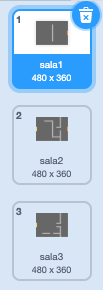
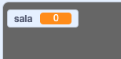
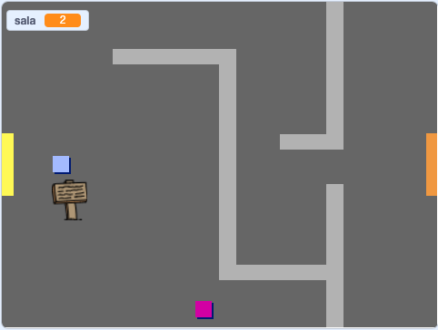

## Mova-se pelo seu mundo

O `player` sprite deve ser capaz de andar pelas portas até outras salas.

Seu projeto contém cenários para salas adicionais:



\--- task \---

Crie uma nova variável 'para todos os sprites' chamada `room` {:class="block3variables"} para acompanhar qual sala o jogador ` ` sprite está dentro.

[[[generic-scratch3-add-variable]]]

 \--- /task \---

\--- tarefa \--- Quando o sprite `player` toca a porta laranja na primeira sala, o jogo deve exibir o próximo pano de fundo, e o `player` sprite deve voltar para o lado esquerdo da etapa. Adicione este código dentro do `player` sprite `forever`{:class="block3control"} loop:


```blocks3
when flag clicked
forever
    if <key (up arrow v) pressed? > then
        point in direction (0)
        move (4) steps
    end
    if <key (left arrow v) pressed? > then
        point in direction (-90)
        move (4) steps
    end
        if <key (down arrow v) pressed? > then
        point in direction (-180)
        move (4) steps
    end
        if <key [right arrow v] pressed? > then
        point in direction (90)
        move (4) steps
    end
    if < touching color [#BABABA]? > then
    move (-4) steps
    end
+   if < touching color [#F2A24A] > then
    switch backdrop to (next backdrop v)
    go to x: (-200) y: (0)
    change [room v] by (1)
    end
end
```

\--- /task \---

\--- task \--- Toda vez que o jogo começa, a sala, a posição do personagem e o cenário precisam ser redefinidos.

Adicione código ao **start** do seu `player` o código sprite acima do `forever{:class="block3control"}`, para redefinir tudo quando o sinalizador é clicado:

\--- dicas \--- \--- dica \--- Quando o jogo começa:

+ O valor de `room`{:class="block3variables"} deve ser definido como `1`{:class="block3variables"}
+ O `backdrop`{:class="block3looks"} deve ser definido para `room1`{:class="block3looks"}
+ A posição do jogador `player` o sprite deve ser definido como `x: -200 y: 0 ` {:class="block3motion"} \--- / dica \--- \--- dica \--- Aqui estão os blocos extras que você precisa:


```blocks3
go to x: (-200) y: (0)

set [room v] to (1)

switch backdrop to (room1 v)
```

\--- /hint \--- \--- hint \--- Here's what your finished script should look like:


```blocks3
when flag clicked
+set [room v] to (1)
+go to x: (-200) y: (0)
+switch backdrop to (room1 v)
forever
    if <key (up arrow v) pressed? > then
        point in direction (0)
        move (4) steps
    end
    if <key (left arrow v) pressed? > then
        point in direction (-90)
        move (4) steps
    end
        if <key (down arrow v) pressed? > then
        point in direction (-180)
        move (4) steps
    end
        if <key [right arrow v] pressed? > then
        point in direction (90)
        move (4) steps
    end
    if < touching color [#BABABA]? > then
    move (-4) steps
    end
    if < touching color [#F2A24A] > then
    switch backdrop to (next backdrop v)
    go to x: (-200) y: (0)
    change [room v] by (1)
end
end
```

\--- /hint \--- \--- /hints \---

\--- /task \---

\--- tarefa \--- Clique na bandeira, e então mova seu `player` sprite até que ela toque na porta laranja. O sprite se move para a próxima tela? A `room`{:class="block3variables"} variável muda para `2`?

 \--- / tarefa \---