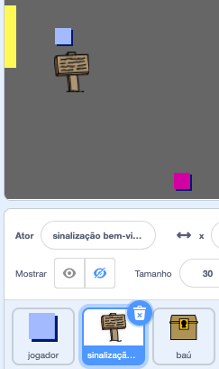
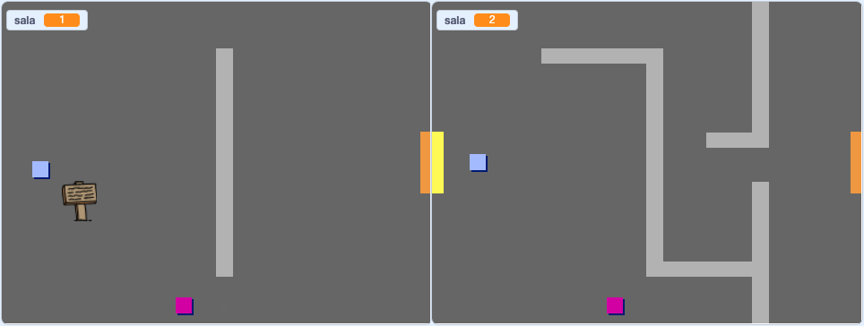
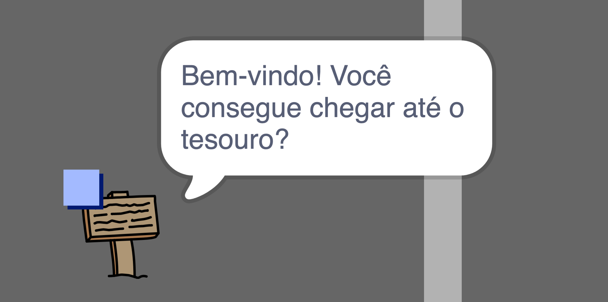

## Signs

Agora adicione sinais ao seu mundo para guiar jogadores em sua jornada.

Seu projeto inclui um sinal de boas-vindas `welcome sign` sprite:



\--- tarefa \--- O `welcome sign` sprite só deve estar visível na sala 1, então adicione algum código ao sprite para garantir que isso aconteça:

`When the flag is clicked`{:class="block3events"}, em `forever`{:class="block3control"} verifique `if`{:class="block3control"} a `room is 1`{:class="block3variables"} e, nesse caso, `show`{:class="block3looks"} `welcome sign` sprite, `else`{:class="block3control"} `hide`{:class="block3looks"} the sprite. \--- /hint \--- \--- hint \--- Aqui estão os blocos que você vai precisar:


```blocks3
<br />if < > then
else
end

< (room :: variables) = [1] >

hide

show

forever
end

when flag clicked

```

\--- /hint \--- \--- dica \--- Aqui está o código completo:


```blocks3
when flag clicked
forever
    if < (room :: variables) = [1] > then
        show
    else
        hide
    end
end
```

\--- /hint \--- \--- /hints \---

\--- /task \---

\--- tarefa \--- Teste o código para o seu `welcome sign` sprite movendo-se entre salas. O sinal só deve estar visível na sala 1.

 \--- /task \---

\--- task \--- Um sinal não é muito bom se não diz nada! Adicione um pouco mais de código para exibir uma mensagem se o sinal de boas-vindas ` ` sprite está tocando no ` player ` sprite:


```blocks3
when flag clicked
forever
if < (room :: variables) = [1] > then
show
else
hide
end
+if < touching (player v)? > then
say [Welcome! Can you get to the treasure?]
else
say []
end
end
```

\--- /task \---

\--- tarefa \--- Teste seu `player` sprite novamente. You should now see a message when the `player` sprite touches the `welcome sign` sprite.

 \--- /task \---