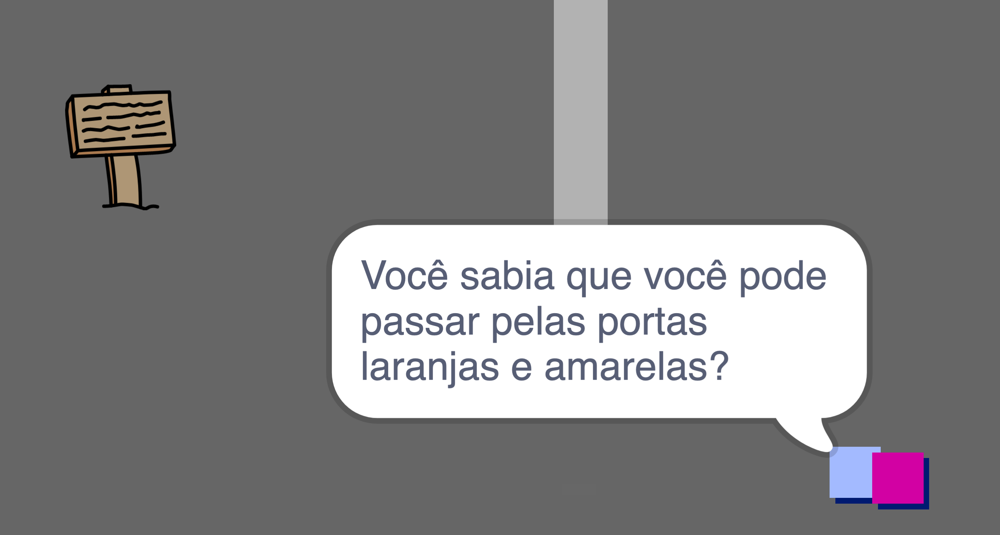

## People

Adicione outras pessoas ao seu mundo com quem seu `player` sprite pode interagir.

\--- tarefa \--- Alterne para a `person` sprite.

 \--- /task \---

\--- tarefa \--- Adicione algum código ao sprite `person` para que a pessoa fale com o sprite `player`. Este código é muito parecido com o código que você adicionou ao seu `sign` sprite:


```blocks3
when flag clicked
go to x: (0) y: (-150)
forever
    if < touching (player v)? > then
        say [Did you know that you can go through orange and yellow doors?]
    else
        say []
    end
end
```

\--- /task \---

\--- tarefa \--- Permita que seu `person` sprite se mova adicionando estes dois blocos no `else`{:class="block3control"} seção do seu código:


```blocks3
when flag clicked
go to x: (0) y: (-150)
forever
    if < touching (player v)? > then
        say [Did you know that you can go through orange and yellow doors?]
    else
        say []
+       move (1) steps
+       if on edge, bounce
    end
end

```

\--- /task \---

Seu `person` sprite agora vai se mover, mas vai parar para falar com o sprite `player`.



\--- task \--- Add code to your new `person` sprite so that the sprite only appears in room 1. O código que você precisa é exatamente o mesmo que o código que torna o `sign` sprite visível apenas na sala 1.

Certifique-se de testar seu novo código. \--- /task \---