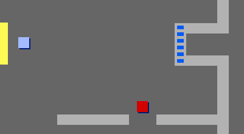

## Uși și chei

Acum vei adăuga cod, astfel încât unele dintre ușile din lumea ta să fie încuiate, iar jucătorul trebuie să găsească cheia pentru a le deschide și a ajunge în camera următoare.

\--- task \---

Schimbă la personajul `cheie`. Dă click pe `arată`{:class="blocklooks"} în meniul Cod pentru ca personajul cheie să apară pe Scenă.

\--- /task \---

\--- task \---

Editează costumul personajului `cheie`, astfel încât să fie albastru.

\--- /task \---

\--- task \---

Schimbă decorul Scenei la camera 3 și plasează personajul `cheie` undeva greu de ajuns!


\--- /task \---

\--- task \---

Adaugă cod personajului `cheie` pentru a-l face vizibil doar în camera 3.

\--- /task \---

\--- task \---

Creează o nouă listă numită `inventar`{:class="block3variables"} pentru a stoca elementele colecțate de personajul tău `jucător`.

[[[generic-scratch3-make-list]]]

\--- /task \---

\--- task \---

Codul pe care trebuie să-l adaugi pentru colectarea cheii este foarte asemănător cu codul pentru colectarea monedelor. Diferența este că adăugați cheia în `inventar`{:class="block3variables"}.


```blocks3
when flag clicked
wait until <touching (player v)?>
add [blue key] to [inventory v]
hide
stop [other scripts in sprite v]
```

\--- /task \---

\--- task \---

Adaugă cod Scenei tale pentru a goli inventarul la începutul jocului.

```blocks3
delete all of [inventory v]
```

\--- /task \---

\--- task \---

Testează-ți jocul pentru a verifica dacă poți colecta personajul `cheie` și să îl adaugi în inventar.

\--- /task \---

\--- task \---

Acum adaugă ușa încuiată. Selectează personajul `ușa-albastră` și dă click pe `arată`{:class="blocklooks}, apoi poziționează-l peste gaura dintre cei doi pereți.



\--- /task \---

\--- task \---

Adaugă niște cod personajului `inamic` astfel încât să apară doar în camera 3.

\--- /task \---

\--- task \---

Adaugă cod personajului `ușa-albastră`, astfel încât, atunci când cheia se află în `inventar`{:class="block3variables"}, acesta se `ascunde`{:class="block3looks"} pentru a permite personajului `jucător`să treacă.


```blocks3
when flag clicked
wait until <[inventory v] contains [blue key]?>
stop [other scripts in sprite v]
hide
```

\--- /task \---

\--- task \---

Testează-ți jocul și vezi dacă poți colecta cheia albastră pentru a deschide ușa!

\--- /task \---