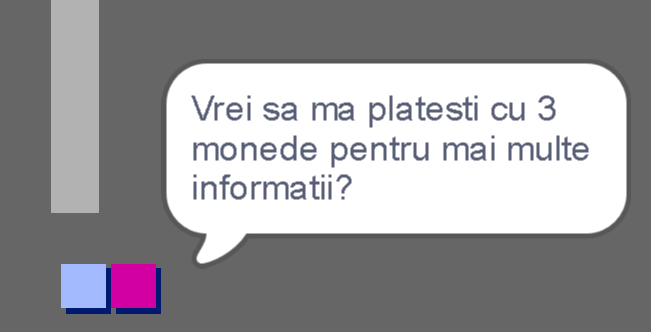
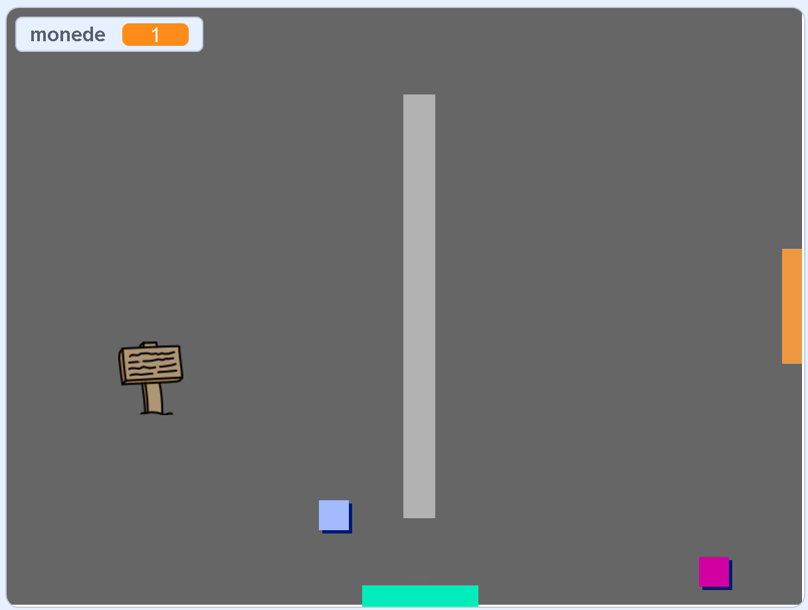
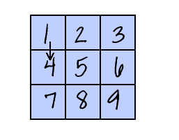

## Provocare: extinde-ți lumea

Acum poți continua să-ți creezi propria lume! Iată câteva idei:

+ Adaugă mai multe monede la joc în camere diferite. Poți lăsa unele monede să fie păzite prin patrularea inamicilor?
+ Schimbă decorurile jocului
+ Adaugă sunete și muzică jocului tău
+ Adaugați mai multe persoane, inamici și semne
+ Adaugă uși roșii și galbene și chei speciale pentru a le deschide
+ Adaugă mai multe camere în lumea ta
+ Adaugă alte elemente utile jocului tău
    
    + Folosește monedele pentru a obține informații de la alte persoane:



+ Ai putea să adaugi uși în pereții nordici și sudici ai camerei 1, astfel încât jucătorul să se poată deplasa între camere în toate cele patru direcții. De exemplu, jocul tău poate avea nouă camere într-o grilă 3×3. Poți apoi să adaugi `3` la numărul camerei pentru a te deplasa cu un nivel în jos.





```blocks3
if <touching color [ ]?> then
switch backdrop to ((costume [number v]) + (3))
go to x:(0) y:(200)
change [room v] by (3)
```