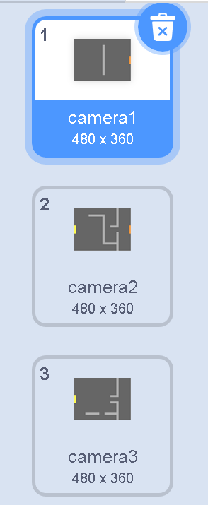
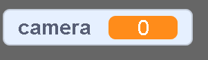
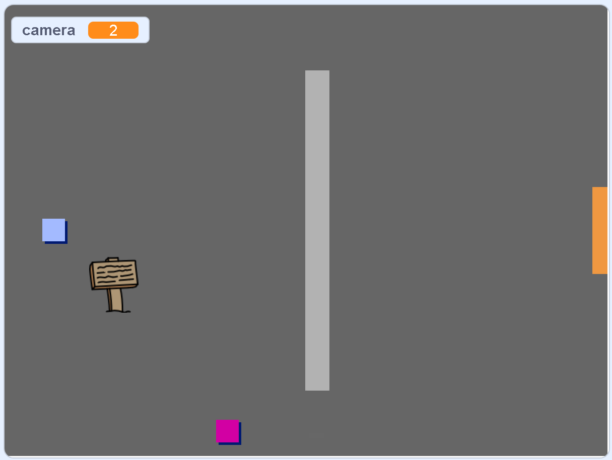

## Mișcă-te în jurul lumii tale

Personajul `jucător` ar trebui să poată să treacă prin uși în alte camere.

Proiectul tău conține decoruri pentru noi camere:



\--- task \---

Creează o nouă variabilă „pentru toate personajele” numită `camera`{:class="block3variables"} pentru a monitoriza în care dintre camere se află personajul `jucător`.

[[[generic-scratch3-add-variable]]]



\--- /task \---

\--- task \---

Când personajul `jucător` atinge ușa portocalie din prima cameră, jocul ar trebui să afișeze următorul decor, iar personajul `jucător` să se mute înapoi în partea stângă a Scenei. Adaugă acest cod în bucla `la infinit`{:class="block3control"} a personajului `jucător`:


```blocks3
when flag clicked
forever
    if <key (up arrow v) pressed? > then
        point in direction (0)
        move (4) steps
    end
    if <key (left arrow v) pressed? > then
        point in direction (-90)
        move (4) steps
    end
        if <key (down arrow v) pressed? > then
        point in direction (180)
        move (4) steps
    end
        if <key [right arrow v] pressed? > then
        point in direction (90)
        move (4) steps
    end
    if < touching color [#BABABA]? > then
    move (-4) steps
    end
+   if < touching color [#F2A24A] > then
    switch backdrop to (next backdrop v)
    go to x: (-200) y: (0)
    change [room v] by (1)
    end
end
```

\--- /task \---

\--- task \---

De fiecare dată când începe jocul, camera, poziția personajului și decorul trebuie să fie resetate.

Adaugă codul la **începutul** codului personajului `jucător` care se află deasupra buclei `la infinit`{:class="block3control"}, pentru a reseta totul atunci când se dă click pe steag:

\--- hints \---

\--- hint \---

Când începe jocul:

+ Valoarea variabilei `camera`{:class="block3variables"} ar trebui setată ca `1`{:class="block3variables"}
+ `Decorul`{:class="block3looks"} ar trebui setat pe `camera1`{:class="block3looks"}
+ Poziția personajului `jucător` trebuie setată la `x: -200 y: 0`{:class="block3motion"}

\--- /hint \---

\--- hint \---

Aici sunt blocurile suplimentare de care ai nevoie:


```blocks3
go to x: (-200) y: (0)

set [room v] to (1)

switch backdrop to (room1 v)
```

\--- /hint \---

\--- hint \---

Iată cum ar trebui să arate scriptul tău finalizat:


```blocks3
when flag clicked
+set [room v] to (1)
+go to x: (-200) y: (0)
+switch backdrop to (room1 v)
forever
    if <key (up arrow v) pressed? > then
        point in direction (0)
        move (4) steps
    end
    if <key (left arrow v) pressed? > then
        point in direction (-90)
        move (4) steps
    end
        if <key (down arrow v) pressed? > then
        point in direction (180)
        move (4) steps
    end
        if <key [right arrow v] pressed? > then
        point in direction (90)
        move (4) steps
    end
    if < touching color [#BABABA]? > then
    move (-4) steps
    end
    if < touching color [#F2A24A] > then
    switch backdrop to (next backdrop v)
    go to x: (-200) y: (0)
    change [room v] by (1)
end
end
```

\--- /hint \---

\--- /hints \---

\--- /task \---

\--- task \---

Dă click pe steag și apoi mută personajul `jucător` până când atinge ușa portocalie. Personajul s-a mutat în următoarea cameră? Valoarea variabilei `camera`{:class="block3variables"} s-a modificat la `2`?



\--- /task \---