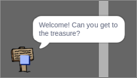

## Semne

Acum adaugă semne în lumea ta pentru a ghida jucătorii în călătoria lor.

Proiectul dvs. include o `urare de bun venit` personajului:


\--- task \--- `Urarea de bun venit` ar trebui să fie vizibilă numai în camera 1, deci adăugă niște cod pentru a te asigura că se întâmplă acest lucru:

\--- hints \--- \--- hint \--- `When the flag is clicked`{:class="block3events"}, in a `forever`{:class="block3control"} loop, check `if`{:class="block3control"} the `room is 1`{:class="block3variables"} and in that case `show`{:class="block3looks"} `welcome sign` sprite, `else`{:class="block3control"} `hide`{:class="block3looks"} the sprite. \--- /hint \--- \--- hint \--- Aici sunt căsuțele de care ai nevoie:


```blocks3
<br />if < > then
else
end

< (room :: variables) = [1] >

hide

show

forever
end

when flag clicked

```

\--- /hint \--- \--- hint \--- Aici este codul complet:


```blocks3
when flag clicked
forever
    if < (room :: variables) = [1] > then
        show
    else
        hide
    end
end
```

\--- /hint \--- \--- /hints \---

\--- /task \---

\--- task \--- Testează codul pentru `urarea de bun venit` mutând personajul dintr-o cameră în alta. Semnul trebuie să fie vizibil numai în camera 1.

 \--- /task \---

\--- task \--- Un semn nu este util dacă nu spune nimic! Adăugă mai mult cod pentru a afișa un mesaj dacă `urarea de bun venit` este atinsă de către `personaj`:


```blocks3
when flag clicked
forever
if < (room :: variables) = [1] > then
show
else
hide
end
+if < touching (player v)? > then
say [Welcome! Can you get to the treasure?]
else
say []
end
end
```

\--- /task \---

\--- task \--- Testează-ți din nou `urarea de bun venit`. Acum ar trebui să vezi un mesaj când `personajul` atinge `urarea de bun venit`.

 \--- /task \---