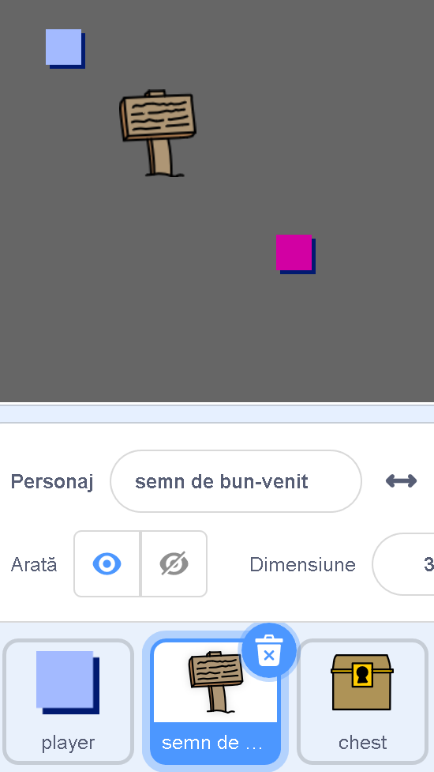
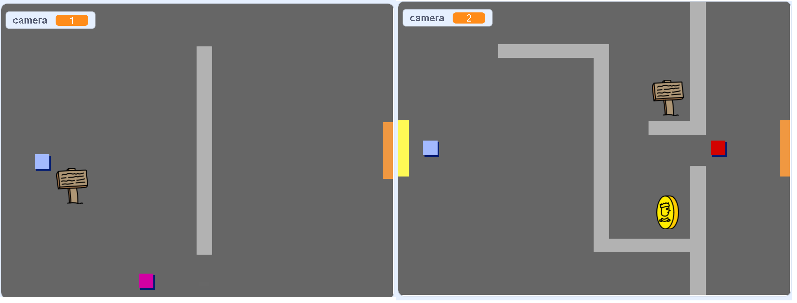
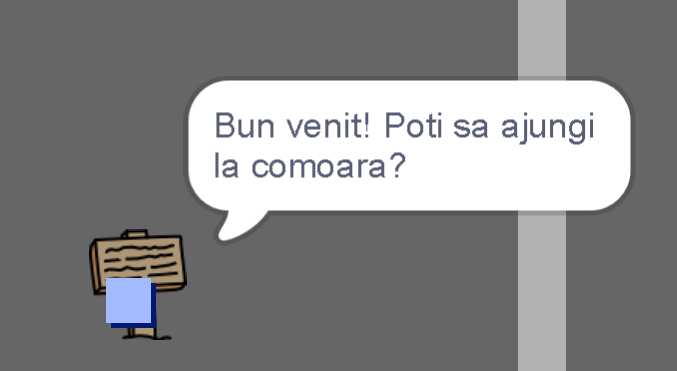

## Semne

Acum adaugă semne în lumea ta pentru a ghida jucătorii în călătoria lor.

Proiectul tău include un personaj `semn de bun-venit`:



\--- task \---

Personajul `semn de bun venit` ar trebui să fie vizibil doar în camera 1, deci adaugă niște cod personajului pentru a te asigura că acest lucru se întâmplă:

\--- hints \---

\--- hint \---

`Cand se da click pe steag`{:class="block3events"}, într-o buclă `la infinit`{:class="block3control"}, testează `daca`{:class="block3control"} variabila `camera este 1`{:class="block3variables"} și atunci `arata`{:class="block3looks"} personajul `semn de bun-venit`, `altfel`{:class="block3control"} `ascunde`{:class="block3looks"} personajul.

\--- /hint \---

\--- hint \---

Iată care sunt blocurile de care ai nevoie:


```blocks3
<br />if < > then
else
end

< (room :: variables) = [1] >

hide

show

forever
end

when flag clicked

```

\--- /hint \---

\--- hint \---

Aici este codul complet:


```blocks3
when flag clicked
forever
    if < (room :: variables) = [1] > then
        show
    else
        hide
    end
end
```

\--- /hint \---

\--- /hints \---

\--- /task \---

\--- task \---

Testează codul personajului tău `semn de bun-venit` prin mutarea între camere. Semnul trebuie să fie vizibil numai în camera 1.



\--- /task \---

\--- task \---

Un semn nu este util dacă nu spune nimic! Adăugă mai mult cod pentru a afișa un mesaj dacă personajul `semn de bun-venit` este atins de către personajul `jucător`:


```blocks3
when flag clicked
forever
if < (room :: variables) = [1] > then
show
else
hide
end
+if < touching (player v)? > then
say [Welcome! Can you get to the treasure?]
else
say []
end
end
```

\--- /task \---

\--- task \---

Testează-ți din nou personajul `semn de bun-venit`. Acum ar trebui să vezi un mesaj când personajul `jucător` atinge personajul `semn de bun-venit`.



\--- /task \---