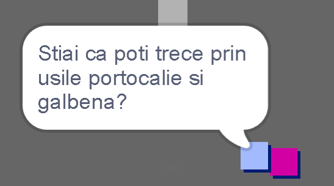

## Personaje

Adaugă în lume alte persoane cu care personajul `jucător` să poată interacționa.

\--- task \---

Schimbă la personajul `persoană`.


\--- /task \---

\--- task \---

Adaugă niște cod personajului `persoană`, astfel încât persoana să vorbească cu personajul `jucător`. Acest cod este similar cu cel pe care l-ai folosit în personajul `semn`:


```blocks3
when flag clicked
go to x: (0) y: (-150)
forever
    if < touching (player v)? > then
        say [Did you know that you can go through orange and yellow doors?]
    else
        say []
    end
end
```

\--- /task \---

\--- task \---

Permite personajului tău `persoană` să se miște prin adăugarea acestor două blocuri în secțiunea `altfel`{:class="block3control"} a codului tău:


```blocks3
when flag clicked
go to x: (0) y: (-150)
forever
    if < touching (player v)? > then
        say [Did you know that you can go through orange and yellow doors?]
    else
        say []
+       move (1) steps
+       if on edge, bounce
    end
end
```

\--- /task \---

Personajul `persoană` se va mișca acum, dar se va opri pentru a vorbi cu personajul `jucător`.



\--- task \---

Adaugă cod noului tău personaj `persoană`, astfel încât personajul să apară doar în camera 1. Codul de care ai nevoie este exact același cu cel care face ca personajul `semn de bun-venit` să fie vizibil doar în camera 1.

Asigură-te că îți testezi noul cod.

\--- /task \---