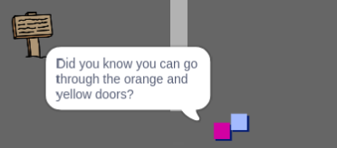

## Personaje

Adăugă în lume alte personaje cu care `personajul principal` poate interacționa.

\--- sarcină \--- Schimbă la personajul `persoană`.

 \--- /task \---

\--- task \--- Adăugă un cod la personajul `persoană` astfel încât persoana să vorbească cu ` personajul principal`. Acest cod este similar cu liniile de cod pe care l-ai folosit pentru `semne`:


```blocks3
when flag clicked
go to x: (0) y: (-150)
forever
    if < touching (player v)? > then
        say [Did you know that you can go through orange and yellow doors?]
    else
        say []
    end
end
```

\--- /task \---

\--- task \--- Permite-i personajului `persoană` să se deplaseze adăugând aceste două căsuțe în secțiunea `else`{:class="block3control"} codului tău:


```blocks3
when flag clicked
go to x: (0) y: (-150)
forever
    if < touching (player v)? > then
        say [Did you know that you can go through orange and yellow doors?]
    else
        say []
+       move (1) steps
+       if on edge, bounce
    end
end

```

\--- /task \---

Personajul `persoană` se va mișca acum, dar se va opri pentru a vorbi cu `personajul principal`.



\--- task \--- Adăugă cod la nouul tău personaj, `persoană`, astfel încât să apară doar în camera 1. Codul de care ai nevoie este exact același cu cel care face ca `urarea de bun venit` să fie vizibilă doar în camera 1.

Asigură-te că îți testezi noul cod. \--- /task \---