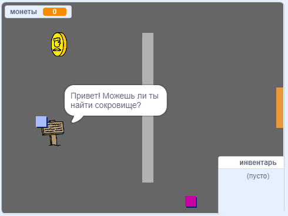

\--- no-print \---

Это версия проекта для **Scratch 3**. Есть также [версия проекта для Scratch 2](https://projects.raspberrypi.org/en/projects/create-your-own-world-scratch2).

\--- /no-print \---

## Введение

В этом проекте ты узнаешь, как создать свой собственный игровой мир с несколькими уровнями, которые ты сможешь исследовать.

### Что ты сделаешь

\--- no-print \---

Нажми на зеленый флажок, чтобы начать. Используй клавиши со стрелками для перемещения своего персонажа по миру.

  <iframe allowtransparency="true" width="485" height="402" src="https://scratch.mit.edu/projects/embed/258757783/?autostart=false" frameborder="0" scrolling="no"></iframe>
  

\--- /no-print \---

\--- print-only \---

Ты будешь использовать клавиши со стрелками для перемещения своего персонажа по миру. 

\--- /print-only \---

## \--- collapse \---

## title: Что тебе понадобится

### Оборудование

- Компьютер, на котором можно запустить Scratch 3

### Программное обеспечение

- Scratch 3 ([онлайн](http://rpf.io/scratchon){:target="_ blank"} или [оффлайн](http://rpf.io/scratchoff){:target="_ blank"} версия)

### Загрузки

Вы можете найти все необходимое для выполнения этого проекта по адресу [rpf.io/p/en/create-your-own-world-go](https://rpf.io/p/en/create-your-own-world-go).

\--- /collapse \---

## \--- collapse \---

## title: Чему ты научишься

- Использовать условный оператор для реагирования на нажатия клавиш
- Использовать переменные для хранения состояния игры
- Использовать значения переменной в условном операторе
- Использовать списки для хранения данных

\--- /collapse \---

## \--- collapse \---

## title: Дополнительная информация для педагогов

Если вам нужно распечатать этот проект, пожалуйста, используйте [версию для печати](https://projects.raspberrypi.org/en/projects/create-your-own-world/print){:target="_blank"}.

Вы можете найти [готовый проект здесь](https://rpf.io/p/en/create-your-own-world-get){:target="_blank"}.

\--- /collapse \---