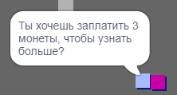
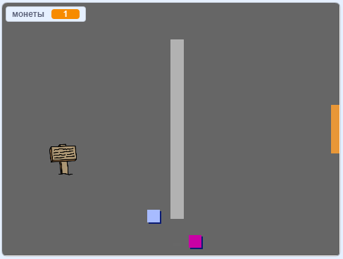

## Задача: расширь свой мир

Теперь ты можете продолжать создавать свой собственный мир! Вот несколько идей:

+ Добавьте больше монет к своей игре разместив их в разных комнатах. Сможешь ли ты добавить врагов, которые бы патрулировали вокруг монет?
+ Измени фоны своей игры
+ Добавь звук и музыку в свою игру
+ Добавь больше людей, врагов и табличек
+ Добавь красные и желтые двери и специальные ключи, чтобы их открыть
+ Добавь дополнительные комнаты в свой мир
+ Добавь в игру другие полезные предметы
    
    + Используй монеты для получения информации от других людей:



+ Ты мог бы добавить двери в северной и южной стенах комнаты 1, чтобы игрок мог перемещаться между комнатами во всех четырех направлениях. Например, твоя игра может иметь девять комнат в виде сетки 3×3. После этого ты можешь добавить `3` к номеру комнаты, чтобы перейти вниз на один уровень.




```blocks3
если <касается цвета [ ] ?> , то 
  переключить фон на ((костюм [номер v]) + (3))
  перейти в x: (0) y: (200)
  изменить [комната v] на (3)
end
```