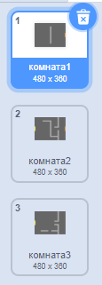
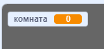
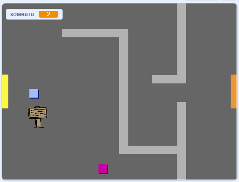

## Перемещение по миру

Спрайт `игрок` должен иметь возможность проходить через двери в другие комнаты.

Твой проект содержит фоны для дополнительных комнат:



\--- task \---

Создайте новую переменную 'для всех спрайтов' под названием `комната`{:class="block3variables"}, чтобы знать, в какой комнате находится спрайт `игрок`.

[[[generic-scratch3-add-variable]]]



\--- /task \---

\--- task \---

When the `player` sprite touches the orange door in the first room, the game should display the next backdrop, and the `player` sprite should move back to the left side of the Stage. Add this code inside the `player` sprite's `forever`{:class="block3control"} loop:


```blocks3
когда щёлкнут по зелёному флагу
повторять всегда 
  если <клавиша (стрелка вверх v) нажата? >, то 
    повернуться в направлении (0)
    идти (4) шагов
  end
  если <клавиша (стрелка влево v) нажата? >, то 
    повернуться в направлении (-90)
    идти (4) шагов
  end
  если <клавиша (стрелка вниз v) нажата? >, то 
    повернуться в направлении (-180)
    идти (4) шагов
  end
  если <клавиша [стрелка вправо v] нажата? >, то 
    повернуться в направлении (90)
    идти (4) шагов
  end
  если < касается цвета [#BABABA]? >, то 
    идти (-4) шагов
  end
  + если < касается цвета [#F2A24A]?>, то 
  +   переключить фон на (следующий фон v)
  +   перейти в x: (-200) y: (0)
  +   изменить [комната v] на (1)
  + end
end
```

\--- /task \---

\--- task \---

Every time the game starts, the room, character position, and backdrop need to be reset.

Add code to the **start** of your `player` sprite code above the `forever`{:class="block3control"} loop, to reset everything when the flag is clicked:

\--- hints \---

\--- hint \---

When the game starts:

+ Значение `комната`{:class = "block3variables"} должен быть установлен в `1`{:class = "block3variables"}
+ `фон`{:class="block3looks"} должен быть установлен в `комната1`{:class="block3looks"}
+ The position of the `player` sprite should be set to `x: -200 y: 0`{:class="block3motion"}

\--- /hint \---

\--- hint \---

Here are the extra blocks you need:


```blocks3
перейти в x: (-200) y: (0)

задать [комната v] значение (1)

переключить фон на (комната1 v)
```

\--- /hint \---

\--- hint \---

Here's what your finished script should look like:


```blocks3
когда щёлкнут по зелёному флагу
+задать [комната v] значение (1)
+перейти в x: (-200) y: (0)
+переключить фон на (комната1 v)
повторять всегда 
  если <клавиша (стрелка вверх v) нажата? >, то 
    повернуться в направлении (0)
    идти (4) шагов
  end
  если <клавиша (стрелка влево v) нажата? >, то 
    повернуться в направлении (-90)
    идти (4) шагов
  end
  если <клавиша (стрелка вниз v) нажата? >, то 
    повернуться в направлении (-180)
    идти (4) шагов
  end
  если <клавиша [стрелка вправо v] нажата? >, то 
    повернуться в направлении (90)
    идти (4) шагов
  end
  если < касается цвета [#BABABA]? >, то 
    идти (-4) шагов
  end
  если < касается цвета [#F2A24A]?>, то 
    переключить фон на (следующий фон v)
    перейти в x: (-200) y: (0)
    изменить [комната v] на (1)
  end
end
```

\--- /hint \---

\--- /hints \---

\--- /task \---

\--- task \---

Click the flag, and then move your `player` sprite until it touches the orange door. Does the sprite move to the next screen? Does the `room`{:class="block3variables"} variable change to `2`?



\--- /task \---