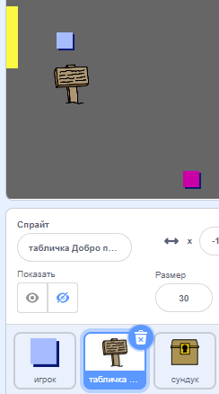
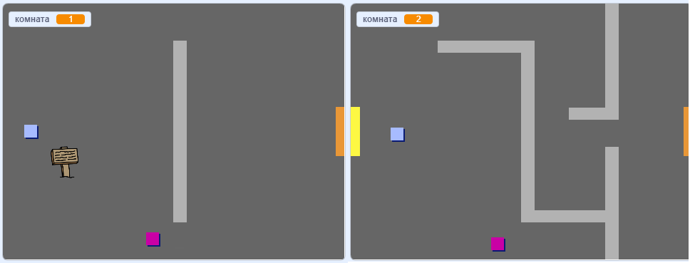
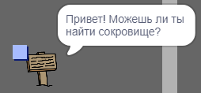

## Таблички

Теперь добавь таблички в свой мир, которые бы помогали игрокам во время их путешествий.

Твой проект включает в себя спрайт `табличка Добро пожаловать`:



\--- task \--- Спрайт `табличка Добро пожаловать` должен быть виден только в комнате 1, поэтому добавьте код к спрайту, чтобы убедиться, что это происходит:

\--- hints \--- \--- hint \--- `Когда зеленый флаг нажат`{:class="block3events"}, в цикле `повторять всегда`{:class="block3control"}` проверь, `если</code>{:class="block3control"} `комната номер 1`{:class="block3variables"}, и в этом случае `покажи`{:class="block3looks"} спрайт `табличка Добро пожаловать`, `иначе`{:class="block3control"} `спрячь</0>{:class="block3looks"} спрайт.
--- /hint --- --- hint ---
Вот блоки кода, которые тебе нужны:</p>

<p></p>

<pre><code class="blocks3"><br />если <>, то 
 
иначе
end

<(комната :: переменные) = [1]>

спрятаться

показаться

повторять всегда
end

когда щёлкнут по зелёному флагу

`</pre> 

\--- /hint \--- \--- hint \--- Вот полный код:


```blocks3
когда щёлкнут по зелёному флагу
повторять всегда 
  если <(комната :: переменные) = [1]>, то 
    показаться
  иначе 
    спрятаться
  end
end
```

\--- /hint \--- \--- /hints \---

\--- /task \---

\--- task \--- Протестируй код спрайта `табличка Добро пожаловать`, перемещаясь между комнатами. Табличка должна быть видна только в комнате 1.

 \--- /task \---

\--- task \--- Табличка не очень хороша, если на ней ничего не написано! Добавь код, который бы показывал сообщение, если спрайт `табличка Добро пожаловать` касается спрайта `игрок`:


```blocks3
когда щёлкнут по зелёному флагу
повторять всегда 
 если <(комната :: переменные) = [1]>, то 
 показаться
 иначе 
 спрятаться
 end
 + если < касается (игрок v) ? >, то 
 + сказать [Привет! Можешь ли ты найти сокровище?]
 + иначе 
 + сказать []
 + end
end
```

\--- /task \---

\--- task \--- Cнова проверь свой спрайт `табличка Добро пожаловать`. Теперь ты должен видеть сообщение, когда спрайт `игрок` коснется спрайта `табличка Добро пожаловать`.

 \--- /task \---