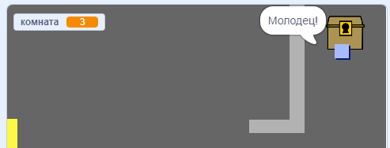

## Задача: сокровище!

Можешь ли ты добавить сокровища, чтобы игрок мог их собирать?

Сделай спрайт `сундук с сокровищами`, который должен только появляться в комнате 3. Пусть этот спрайт говорит: «Молодец!», когда спрайт `игрок` его коснётся.

