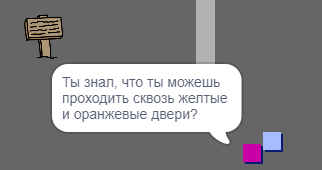

## Люди

Добавьте в свой мир других людей, с которыми твой спрайт `игрок` мог бы общаться.

\--- task \--- Перейди на спрайт `человек`.

 \--- /task \---

\--- task \--- Добавь код спрайту `человек` так, чтобы этот человек мог разговаривать с спрайтом `игрок`. Этот код очень похож на код, который ты добавил для спрайта `табличка`:


```blocks3
когда щёлкнут по зелёному флагу
перейти в x: (0) y: (-150)
повторять всегда 
  если < касается (игрок v)? >, то 
    сказать [Ты знал, что ты можешь проходить сквозь желтые и оранжевые двери?]
  иначе 
    сказать []
  end
end
```

\--- /task \---

\--- task \--- Добавь спрайту `человек` возможность двигаться путем добавления этих двух блоков в `иначе`{:class="block3control"} ветку твоего кода:


```blocks3
когда щёлкнут по зелёному флагу
перейти в x: (0) y: (-150)
повторять всегда 
  если < касается (игрок v)? >, то 
    сказать [Ты знал, что ты можешь проходить сквозь желтые и оранжевые двери?]
  иначе 
    сказать []
    + идти (1) шагов
    + если касается края, оттолкнуться
  end
end

```

\--- /task \---

Твой спрайт `человек` будет теперь двигаться, но перестанет общаться с спрайтом `игрок`.



\--- task \--- Добавь код к своему новому спрайту `человек` так, чтобы спрайт появляется только в комнате 1. Код, который тебе нужен, точно такой же, как код, который делает спрайт `табличка` только видимой в комнате 1.

Убедитесь, что ты проверили свой новый код. \--- /task \---