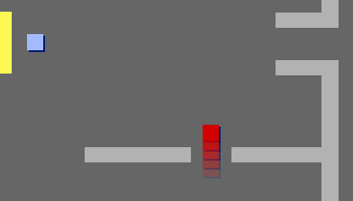

## Задание: добавь врага

Если хочешь, ты можешь добавить патрулирующих врагов в свою игру. Если спрайт `игрок` коснётся врага, игра закончится.

+ Твоя игра уже содержит спрайт `враг`. Добавь код для спрайта `враг`, чтобы он появился только в комнате 2.

+ Добавь код для перемещения спрайта `враг` и для завершения игры, если спрайт `враг` коснется спрайт `игрок`. Это проще сделать в отдельных блоках кода. Вот как мог бы выглядеть твой код для спрайта `враг`:

```blocks3
when flag clicked
forever
if <(room :: variables)=[2]> then
show
else
hide

when flag clicked
forever
if <touching (player v)?> then
stop [all v]

when flag clicked
go to x: (170) y:(0)
forever
repeat (130)
change x by (-1)
end
repeat (130)
change x by (1)
```

+ Проверь свой новый код, чтобы убедиться, что: 
    + Спрайт `враг` присутствует только в комнате 2
    + Спрайт `враг` патрулирует комнату
    + Игра заканчивается, если спрайт `игрок` коснется спрайта `враг`

Можешь ли ты создать еще один спрайт `враг` в комнате 3, который патрулирует вверх и вниз через дыру в стене?

