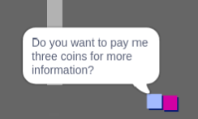

## Výzva: rozšírte svoj svet

Teraz môžete pokračovať vo vytváraní vlastného sveta! Tu je niekoľko nápadov:

+ Pridajte do svojej hry viac mincí v rôznych miestnostiach. Môžete nechať niektoré mince byť strážené hliadkami nepriateľov?
+ Zmeňte zázemie svojej hry
+ Pridajte zvuk a hudbu do hry
+ Pridajte ďalších ľudí, nepriateľov a znakov
+ Pridajte červené a žlté dvere a špeciálne klávesy na ich otvorenie
+ Pridajte ďalšie priestory do vášho sveta
+ Pridajte do hry ďalšie užitočné položky
    
    + Použite mince na získanie informácií od iných ľudí:



+ Môžete dokonca pridať dvere do severnej a južnej steny miestnosti 1, aby sa hráč mohol pohybovať medzi miestnosťami vo všetkých štyroch smeroch. Napríklad vaša hra môže mať deväť miestností v 3 × 3 mriežke. Potom môžete pridať `3` do čísla miestnosti, aby ste sa posunuli o jednu úroveň nadol.


```blocks3
ak <touching color [ ]?> potom
spínací kulisu ((kroj [číslo v]) + (3)),
prejsť na x: (0) y: (200)
zmena [miestnosti v] o (3)
```