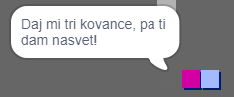
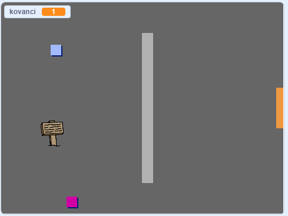

## Izziv: razširi tvoj svet

Sedaj lahko nadaljuješ z ustvarjanjem tvojega sveta! Tu je nekaj idej:

+ Dodaj več kovancev v več sob. Ali lahko poskrbiš, da nekatere kovance pazijo sovražniki, ki se premikajo?
+ Spremeni ozadja svoje igre
+ Igri dodaj glasbo in zvok
+ Dodaj več ljudi, sovražnikov in znakov
+ Dodaj rdeča in rumena vrata in posebne ključe, ki jih odprejo
+ Svetu dodaj še več sob
+ Dodaj še druge koristne predmete
    
    + Uporabi kovance, da pridobiš informacije od drugih ljudi:



+ Lahko celo dodaš vrata na severno in južno steno prve sove, tako da se lahko igralec med sobami premika v vseh štirih smereh. Igra lahko ima denimo 9 sob v 3×3 veliki mreži. Številki sobe lahko v tem primeru dodajaš `3`, da se premakneš eno sobo navzdol.




```blocks3
če < se dotika barve []?> potem
zamenjaj ozadje na ((videz [število v]) + (3))
pojdi na x:(0) y:(200)
spremeni [soba v] za (3)
```