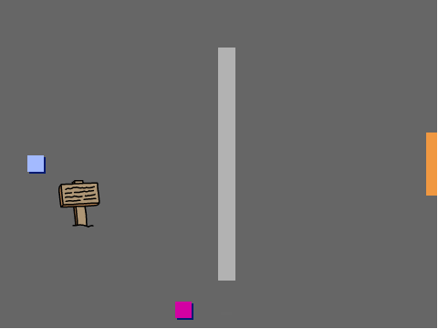

## Premikanje igralčeve figure

Začni tako, da ustvariš figuro `igralec`, ki se lahko premika po tvojem svetu.

\--- task \---

Odpri začetni projekt "Ustvari svoj lastni svet".

**Na spletu:** Odpri začetni projekt na [rpf.io/create-your-own-world-on](http://rpf.io/create-your-own-world-on){: target = "_ blank"}.

Če imaš Scratch uporabniški račun, lahko ustvariš kopijo s klikom na **Predelaj**.

** Brez povezave: ** prenesi začetni projekt iz [rpf.io/p/en/create-your-own-world-go](http://rpf.io/p/en/create-your-own-world-go) {: target = "_ blank"} in ga nato odpri s pomočjo namiznega urejevalnika. Če želiš prenesti in namestiti Namizni Scratch, ga lahko najdeš na [rpf.io/scratchoff](https://rpf.io/scratchoff){: target = "_ blank"}.



\--- /task \---

Ob pritisku na katero od smernih tipk, bi se moral `igralec` premikati nakokoli. Ko je pritisnjena tipka gor, bi se `igralec` moral odzivati tako, da se premika navzgor po odru.

\--- task \---

Figuri `igralec` dodaj to kodo:


```blocks3
ko kliknemo na zastavo
ponavljaj
  če <je pritisnjena tipka (puščica gor v)? > potem
    obrni se v smer (0)
    pojdi (4) korakov
  konec
konec
```

\--- /task \---

\--- task \---

Klikni na zastavo in pritisni smerno tipko gor. Ali se figura `igralec` premika navzgor?


\--- /task \---

\--- task \---

Za premikanje figure `igralec` v levo, moraš dodati še en blok `če`{:class="block3control"} s podobno kodo:


```blocks3
ko kliknemo na zastavo
ponavljaj
  če <je pritisnjena tipka (puščica gor v)? > potem
    obrni se v smer (0)
    pojdi (4) korakov
  konec
+ če <je pritisnjena tipka (puščica levo v)? > potem
    obrni se v smer (-90)
    pojdi (4) korakov
  konec
konec
```

\--- /task \---

\--- task \---

Figuri `igralec` dodaj še več kode, da se bo lahko premikala tudi v desno in navzdol. Uporabi kodo, ki jo že imaš, da si pomagaš.

\--- hints \---

\--- hint \---

Za premikanje gor moraš figuro `igralec` obrniti v smer `0` stopinj. Kaj moraš storiti, da figuro premikaš navzdol?

Za premikanje v levo moraš figuro obrniti v smer `-90` stopinj. Kaj moraš storiti, da figuro premikaš v desno?

\--- /hint \---

\--- hint \---

Spremeniti moraš ta dva bloka:


```blocks3
<key ( v) pressed>

obrni se v smer ()
```

Podvoji kodo, ki omogoča premikanje figure `igralec` navzgor in spremeni ta dva bloka, da se figura premika navzdol. Ponovno podovji to kodo in jo spremeni tako, da se bo figura premikala v desno.

\--- /hint \---

\--- hint \---

Here is how your code should look:


```blocks3
ko kliknemo na zastavo
ponavljaj
  če <je pritisnjena tipka (puščica gor v)? > potem
    obrni se v smer (0)
    pojdi (4) korakov
  konec
če <je pritisnjena tipka (puščica levo v)? > potem
    obrni se v smer (-90)
    pojdi (4) korakov
  konec
+ če <je pritisnjena tipka (puščica dol v)? > potem
    obrni se v smer (180)
    pojdi (4) korakov
  konec
če <je pritisnjena tipka (puščica desno v)? > potem
    obrni se v smer (90)
    pojdi (4) korakov
  konec
konec
```

\--- /hint \---

\--- /hints \---

\--- /task \---