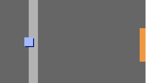

## Trdne stene

\--- task \---

Test your `player` sprite again. Do you see that it can walk through the light grey walls.



\--- /task \---

\--- task \---

To fix this, you need to make the `player` sprite move back if it touches a light grey wall. Here's the code you need to add inside your `forever`{:class="block3control"} block below the direction blocks:


```blocks3
ko kliknemo na zastavo
ponavljaj
  če <je pritisnjena tipka (puščica gor v)? > potem
    obrni se v smer (0)
    pojdi (4) korakov
  konec
če <je pritisnjena tipka (puščica levo v)? > potem
    obrni se v smer (-90)
    pojdi (4) korakov
  konec
+ če <je pritisnjena tipka (puščica dol v)? > potem
    obrni se v smer (180)
    pojdi (4) korakov
  konec
+ če <je pritisnjena tipka (puščica desno v)? > potem
    obrni se v smer (90)
    pojdi (4) korakov
  konec
+ če < se dotika barve [#BABABA]? > potem
    pojdi (-4) korakov
    konec
konec
```

\--- /task \---

\--- task \---

Try to make the `player` sprite move through a wall. If your new code works, this shouldn't be possible.


\--- /task \---