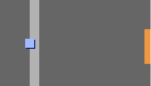

## Trdne stene

\--- task \---

Ponovno preizkusi figuro `igralec`. Do you see that it can walk through the light grey walls?



\--- /task \---

\--- task \---

To popraviš tako, da poskrbiš, da se figura `igralec` pomakne nazaj, kadar se dotakne svetlo-sive stene. Takšna je koda, ki jo moraš dodati znotraj bloka `ponavljaj`{:class="block3control"}, pod bloke, ki skrbijo za premikanje:


```blocks3
ko kliknemo na zastavo
ponavljaj
  če <je pritisnjena tipka (puščica gor v)? > potem
    obrni se v smer (0)
    pojdi (4) korakov
  konec
če <je pritisnjena tipka (puščica levo v)? > potem
    obrni se v smer (-90)
    pojdi (4) korakov
  konec
+ če <je pritisnjena tipka (puščica dol v)? > then
        point in direction (180)
        move (4) steps
    end
        if <key (right arrow v) pressed? > potem
    obrni se v smer (90)
    pojdi (4) korakov
  konec
+ če < se dotika barve [#BABABA]? > potem
    pojdi (-4) korakov
    konec
konec
```

\--- /task \---

\--- task \---

Poskusi premakniti figuro `igralec` skozi zid. Če tvoja koda deluje, to ne bi smelo biti mogoče.


\--- /task \---