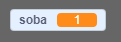
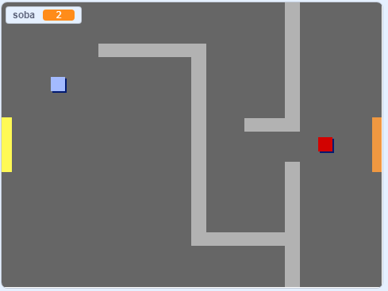

## Premikanje po tvojem svetu

Figura `igralca` bi morala biti spodobna hoditi skozi vrata v druge sobe.

Tvoj projekt vsebuje ozadja za dodatne sobe:


\--- task \---

Ustvari novo spremenljivko, ki je namenjena vsem figuram, in jo poimenuj `soba`{:class="block3variables"}. Z njo bomo opazovali, v kateri sobi se figura `igralec` nahaja.

[[[generic-scratch3-add-variable]]]



\--- /task \---

\--- task \---

When the `player` sprite touches the orange door in the first room, the game should display the next backdrop, and the `player` sprite should move back to the left side of the Stage. Add this code inside the `player` sprite's `forever`{:class="block3control"} loop:


```blocks3
ko kliknemo na zastavo
ponavljaj
  če <je pritisnjena tipka (puščica gor v)? > potem
    obrni se v smer (0)
    pojdi (4) korakov
  konec
  če <je pritisnjena tipka (puščica levo v)? > potem
    obrni se v smer (-90)
    pojdi (4) korakov
  konec
  če <je pritisnjena tipka (puščica dol v)? > potem
    obrni se v smer (180)
    pojdi (4) korakov
  konec 
  če <je pritisnjena tipka (puščica desno v)? > potem
    obrni se v smer (90)
    pojdi (4) korakov
  konec 
  če < se dotika barve [#BABABA]? > potem
    pojdi (-4) korakov
  konec
+  če < se dotika barve [#F2A24A] > potem
    zamenjaj ozadje na (naslednje ozadje v)
    pojdi na x: (-200) y: (0)
    spremeni [soba v] za (1)
    konec
konec
```

\--- /task \---

\--- task \---

Every time the game starts, the room, character position, and backdrop need to be reset.

Add code to the **start** of your `player` sprite code above the `forever`{:class="block3control"} loop, to reset everything when the flag is clicked:

\--- hints \---

\--- hint \---

When the game starts:

+ Vrednost spremenljivke `soba`{:class="block3variables"} mora biti nastavljena na `1`{:class="block3variables"}
+ `ozadje`{:class="block3looks"} se naj zamenja na `soba1`{:class="block3looks"}
+ The position of the `player` sprite should be set to `x: -200 y: 0`{:class="block3motion"}

\--- /hint \---

\--- hint \---

Here are the extra blocks you need:


```blocks3
pojdi na x:(-200) y: (0)

nastavi[soba v] na (1)

zamenjaj ozadje na (soba1 v)
```

\--- /hint \---

\--- hint \---

Here's what your finished script should look like:


```blocks3
ko kliknemo na zastavo
+nastavi [soba v] na (1)
+pojdi na x:(-200) y: (0)
+zamenjaj ozadje na (soba1 v)
ponavljaj
  če <je pritisnjena tipka (puščica gor v)? > potem
    obrni se v smer (0)
    pojdi (4) korakov
  konec
  če <je pritisnjena tipka (puščica levo v)? > potem
    obrni se v smer (-90)
    pojdi (4) korakov
  konec
  če <je pritisnjena tipka (puščica dol v)? > potem
    obrni se v smer (180)
    pojdi (4) korakov
  konec 
  če <je pritisnjena tipka (puščica desno v)? > potem
    obrni se v smer (90)
    pojdi (4) korakov
  konec 
  če < se dotika barve [#BABABA]? > potem
    pojdi (-4) korakov
  konec
+  če < se dotika barve [#F2A24A] > potem
    zamenjaj ozadje na (naslednje ozadje v)
    pojdi na x: (-200) y: (0)
    spremeni [soba v] za (1)
    konec
konec
```

\--- /hint \---

\--- /hints \---

\--- /task \---

\--- task \---

Click the flag, and then move your `player` sprite until it touches the orange door. Does the sprite move to the next screen? Does the `room`{:class="block3variables"} variable change to `2`?



\--- /task \---