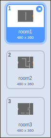
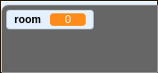

## Premikanje po tvojem svetu

Figura `igralca` bi morala biti spodobna hoditi skozi vrata v druge sobe.

Tvoj projekt vsebuje ozadja za dodatne sobe:



\--- task \---

Ustvari novo spremenljivko, ki je namenjena vsem figuram, in jo poimenuj `soba`{:class="block3variables"}. Z njo bomo opazovali, v kateri sobi se figura `igralec` nahaja.

[[[generic-scratch3-add-variable]]]



\--- /task \---

\--- task \---

Ko se figura `igralec` dotakne oranžnih vrat v prvi sobi, naj igra prikaže naslednje ozadje, figura `igralec` pa naj se premakne nazaj na levo stran odra. V zanko `ponavljaj`{:class="block3control"}, ki se nahaja v figuri `igralec`, dodaj to kodo:


```blocks3
ko kliknemo na zastavo
ponavljaj
  če <je pritisnjena tipka (puščica gor v)? > potem
    obrni se v smer (0)
    pojdi (4) korakov
  konec
  če <je pritisnjena tipka (puščica levo v)? > potem
    obrni se v smer (-90)
    pojdi (4) korakov
  konec
  če <je pritisnjena tipka (puščica dol v)? > then
        point in direction (180)
        move (4) steps
    end
        if <key [right arrow v] pressed? > potem
    obrni se v smer (90)
    pojdi (4) korakov
  konec 
  če < se dotika barve [#BABABA]? > potem
    pojdi (-4) korakov
  konec
+  če < se dotika barve [#F2A24A] > potem
    zamenjaj ozadje na (naslednje ozadje v)
    pojdi na x: (-200) y: (0)
    spremeni [soba v] za (1)
    konec
konec
```

\--- /task \---

\--- task \---

Vsakič, ko se igra zažene, moramo ponastaviti sobo, položaj igralca in ozadje.

Na **začetek** kode v tvoji figuri `igralec`, nad zanko `ponavljaj`{:class="block3control"}, dodaj kodo, ki bo ob kliku na zastavico ponastavila vse:

\--- hints \---

\--- hint \---

Ko se igra začne:

+ Vrednost spremenljivke `soba`{:class="block3variables"} mora biti nastavljena na `1`{:class="block3variables"}
+ `ozadje`{:class="block3looks"} se naj zamenja na `soba1`{:class="block3looks"}
+ Položaj figure `igralec` naj se nastavi na `x: -200 y: 0`{:class="block3motion"}

\--- /hint \---

\--- hint \---

Potrebni so ti dodatni bloki:


```blocks3
pojdi na x:(-200) y: (0)

nastavi[soba v] na (1)

zamenjaj ozadje na (soba1 v)
```

\--- /hint \---

\--- hint \---

Tako bi morala izgledati tvoja dokončana koda:


```blocks3
ko kliknemo na zastavo
+nastavi [soba v] na (1)
+pojdi na x:(-200) y: (0)
+zamenjaj ozadje na (soba1 v)
ponavljaj
  če <je pritisnjena tipka (puščica gor v)? > potem
    obrni se v smer (0)
    pojdi (4) korakov
  konec
  če <je pritisnjena tipka (puščica levo v)? > potem
    obrni se v smer (-90)
    pojdi (4) korakov
  konec
  če <je pritisnjena tipka (puščica dol v)? > then
        point in direction (180)
        move (4) steps
    end
        if <key [right arrow v] pressed? > potem
    obrni se v smer (90)
    pojdi (4) korakov
  konec 
  če < se dotika barve [#BABABA]? > potem
    pojdi (-4) korakov
  konec
+  če < se dotika barve [#F2A24A] > potem
    zamenjaj ozadje na (naslednje ozadje v)
    pojdi na x: (-200) y: (0)
    spremeni [soba v] za (1)
    konec
konec
```

\--- /hint \---

\--- /hints \---

\--- /task \---

\--- task \---

Klikni na zastavico in potem premikaj figuro `igralec`, dokler se ne dotakne oranžnih vrat. Ali se je figura premaknila na naslednji zaslon? Ali se spremenljivka `soba`{:class="block3variables"} spremeni v `2`?


\--- /task \---