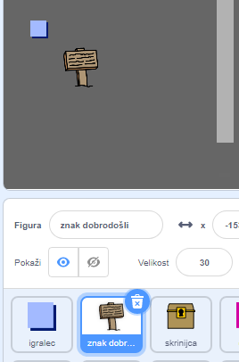
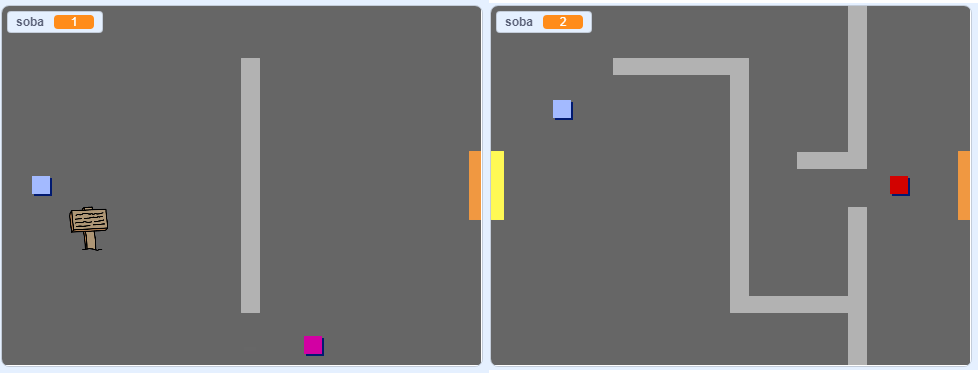
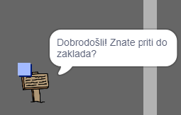

## Znaki

Zdaj v svoj svet dodaj še znake, ki bodo igralca vodili na njegovem potovanju.

V tvojem projektu se nahaja `znak dobrodošli`:



\--- task \--- Figura `znak dobrodošli` naj bo viden le v prvi sobi, zato dodaj nekaj kode, ki bo poskrbela, da bo temu tako:

\--- hints \--- \--- hint \--- `Ko kliknemo na`{:class="block3events"}, v zanki `ponavljaj`{:class="block3control"}, preveri `če`{:class="block3control"} je `soba enako 1`{:class="block3variables"} in v tem primeru `pokaži`{:class="block3looks"} `znak dobrodošli` figuro, `sicer`{:class="block3control"} `skrij`{:class="block3looks"} figuro. \--- /hint \--- \--- hint \--- To so bloki kode, ki jih potrebuješ:


```blocks3
<br />če < > potem
sicer
konec

< (soba: spremenljivke) = [1] >

skrij

pokaži

ponavljaj
konec

ko kliknemo na zastavo

```

\--- /hint \--- \--- hint \--- Tako je videti dokončana koda:


```blocks3
ko kliknemo na zastavo
ponavljaj
    če je < (soba: spremenljivke) = [1] > potem
        pokaži
    sicer
        skrij
    konec
konec
```

\--- /hint \--- \--- /hints \---

\--- /task \---

\--- task \--- Preizkusi kodo svoje figure `znak dobrodošli`, tako da se premikaš med sobama. Znak bi moral biti viden le v prvi sobi.

 \--- /task \---

\--- task \--- Od znaka ni kaj dosti koristi, če ničesar ne pove! Dodaj še nekaj kode, ki prikaže sporočilo, če se figura `znak dobrodošli` dotika figure `igralec`:


```blocks3
ko kliknemo na zastavo
ponavljaj
 če je < (soba: spremenljivke) = [1] > potem
 pokaži
 sicer
 skrij
 konec
+če < se dotika (igralec v)? > potem
reci [Dobrodošli! Ali lahko pridete do zaklada?]
sicer
reci[]
konec
konec
```

\--- /task \---

\--- task \--- Ponovno preizkusi svojo figuro `znak dobrodošli`. Sedaj bi moral videti sporočilo, ko se figura `igralec` dotakne figure `znak dobrodošli`.

 \--- /task \---