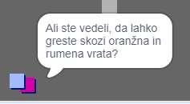

## Ljudje

Svojemu svetu dodaj še druge ljudi, s katerimi se lahko tvoja figura `igralec` sporazumeva.

\--- task \--- Izberi figuro `oseba`.

 \--- /task \---

Figuri `oseba` dodaj nekaj kode, tako da bo ta oseba govorila s figuro `igralec`. Ta koda je zelo podobna kodi, ki si jo dodal-a figuri `znak`:


```blocks3
ko kliknemo na zastavo
pojdi na x: (0) y: (-150)
ponavljaj
  če < se dotika (igralec v)? >; potem
        reci [Ali ste vedeli, da lahko greste skozi oranžna in rumena vrata?]
    sicer
        reci []
    konec
konec
```

\--- /task \---

\--- task \--- Omogoči figuri `oseba`, da se premika. Dodaj ji ta dva bloka v razdelek `sicer`{:class="block3control"} v tvoji kodi:


```blocks3
ko kliknemo na zastavo
pojdi na x: (0) y: (-150)
ponavljaj
  če < se dotika (igralec v)? >; potem
        reci [Ali ste vedeli, da lahko greste skozi oranžna in rumena vrata?]
    sicer
        reci []
+       pojdi (1) korakov
+       odbij se, če si na robu
    konec
konec

```

\--- /task \---

Vaša figura `oseba` se bo sedaj premaknila, a se bo nehala pogovarjati s figuro `igralec`.



\--- task \--- Figuri `oseba` dodaj kodo, da se bo pojavila le v prvi sobi. Koda, ki jo potrebuješ, je popolnoma enaka kodi, ki poskrbi, da je figura `znak` vidna le v prvi sobi.

Poskrbi, da boš preizkusil-a svojo novo kodo. \--- /task \---