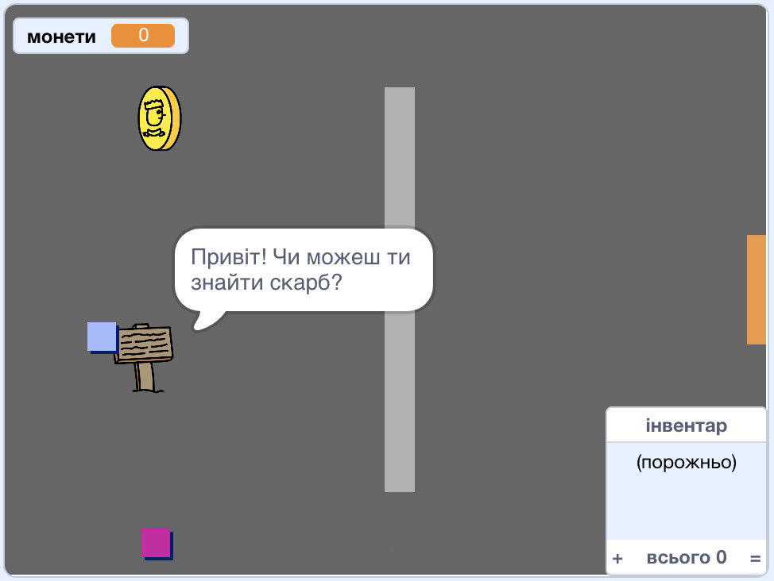

\--- no-print \---

Це — версія проєкту для **Скретч 3**. Також існує [версія проєкту для Скретч 2](https://projects.raspberrypi.org/en/projects/create-your-own-world-scratch2).

\--- /no-print \---

## Вступ

У цьому проєкті ти навчишся створювати власний пригодницький ігровий світ з кількома рівнями для дослідження.

### Що ти зробиш

\--- no-print \---

Натисни на зелений прапор для запуску. Використовуй клавіші зі стрілками для переміщення свого персонажа по світу.

  <iframe allowtransparency="true" width="485" height="402" src="https://scratch.mit.edu/projects/embed/258757783/?autostart=false" frameborder="0" scrolling="no"></iframe>
  

\--- /no-print \---

\--- print-only \---

Ти використовуватимеш клавіші зі стрілками для переміщення персонажа по світу. 

\--- /print-only \---

## \--- collapse \---

## title: Що тобі знадобиться

### Обладнання

- Комп'ютер, що підтримує Скретч 3

### Програмне забезпечення

- Скретч 3 ([онлайн](https://rpf.io/scratchon){:target="_blank"} або [офлайн](https://rpf.io/scratchoff){:target="_blank"})

### Завантаження

Ти зможеш знайти все для реалізації цього проєкту на [rpf.io/p/en/create-your-own-world-go](https://rpf.io/p/en/create-your-own-world-go).

\--- /collapse \---

## \--- collapse \---

## title: Чого ти навчишся

- Використовувати розгалуження при обробці натискання клавіш
- Використовувати змінні для зберігання стану гри
- Використовувати розгалуження на основі значення змінних
- Використовувати списки для збереження даних

\--- /collapse \---

## \--- collapse \---

## title: Додаткова інформація для викладачів

Якщо вам потрібно роздрукувати цей проєкт, будь ласка, скористайтеся [версією для друку](https://projects.raspberrypi.org/en/projects/create-your-own-world/print){:target="_blank"}.

Ви можете знайти [завершений проєкт тут](https://rpf.io/p/en/create-your-own-world-get){:target="_ blank"}.

\--- /collapse \---