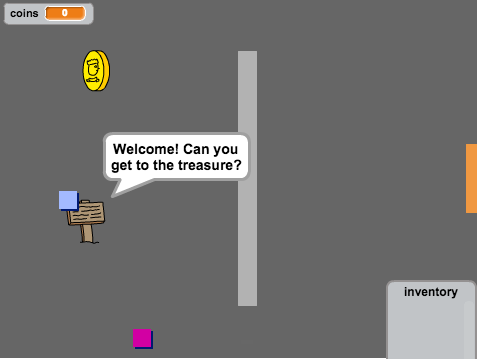

## Вступ

У цьому проекті ви дізнаєтеся, як створити власну пригодницьку гру з кількома кімнатами, щоб гравці могли їх вивчати.

### What you will make

Нажміть на зелений прапорець, щоб почати. Використовуйте клавіші зі стрілками для переміщення вашого персонажа навколо світу.

  <iframe allowtransparency="true" width="485" height="402" src="https://scratch.mit.edu/projects/embed/34248822/?autostart=false" frameborder="0"></iframe>
  

### Що ви дізнаєтесь

Цей проект охоплює елементи з наступних напрямів навчального плану [Raspberry Pi Digital Making Curriculum](http://rpf.io/curriculum){:target="_blank"}:

+ [Combine programming constructs to solve a problem.](https://www.raspberrypi.org/curriculum/programming/builder){:target="_blank"}

### Additional information for educators

Якщо вам потрібно роздрукувати цей проект, будь ласка скористайтеся [printer-friendly version](https://projects.raspberrypi.org/en/projects/create-your-own-world/print){:target="_blank"}.

Скористайтеся посиланням у нижньому колонтитулі, щоб отримати доступ до сховища GitHub для даного проекту, який містить усі ресурси (включаючи приклад готового проекту) в папці `en/resources`.