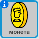

## Збирай монети

Оскільки ваш `player`ельф рухається по світу, він може збирати монети.

+ Додайте нову змінну valled `coins`{:class="blockdata"} до вашого проекту.

+ Клацніть правою кнопкою миші на `coin` ельф і виберіть **show**.



+ Додайте код до `coin` так, щоб він з'явився лише в номері 1.

+ Додайте код до своєї `coin` так, що ` 1 ` додається до `coins`{:class="blockdata"} коли `player` ельф торкається `coin` "зібрати".
    
    ```blocks
        when flag clicked
        wait until <touching [player v]?>
        change [coins v] by (1)
        stop [other scripts in sprite v]
        hide
    ```
    
    Код `stop other scripts in sprite`{: class = "blockcontrol"} потрібно, щоб `coin` ельф перестав відображатися в кімнаті 1, коли їх збирають.

+ Вам також потрібно буде додати код для встановлення `coin` {: class = "blockdata"} до ` 0 ` на початку вашої гри.

+ Перевірте свій проект - збираючи монети, слід змінити свої `coins` score to `1`.

\--- challenge \---

### Challenge: більше монет

Чи можете ви додати більше монет до вашої гри? Вони можуть бути в різних кімнатах, а деякі монети навіть можуть охоронятися ворогами!

\--- /challenge \---