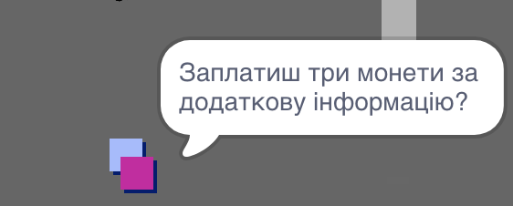
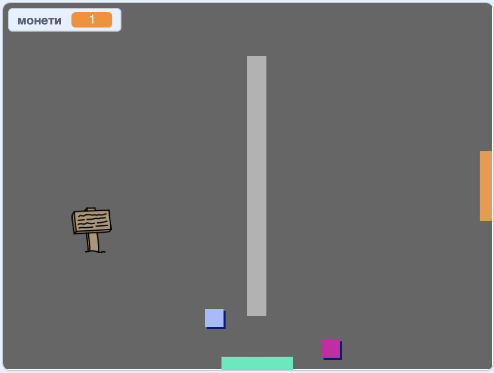

## Challange: розширюйте свій світ

You can now continue creating your own world! Here are some ideas:

+ Add more coins to your game in different rooms. Can you let some coins be guarded by patrolling enemies?
+ Change your game's backdrops
+ Add sound and music to your game
+ Add more people, enemies, and signs
+ Add red and yellow doors, and special keys to open them
+ Add more rooms to your world
+ Add other useful items to your game
    
    + Use coins to get information from other people:



+ Ви навіть можете додати двері на північ та південь стін кімнати 1, щоб гравець міг рухатися між приміщеннями у всіх чотирьох напрямках. For example, your game can have nine rooms in a 3×3 grid. Потім можна додати ` 3 ` до номера кімнати, щоб рухатися вниз на один рівень.

 

```blocks3
if <touching color [ ]?> then
switch backdrop to ((costume [number v]) + (3))
go to x:(0) y:(200)
change [room v] by (3)
```