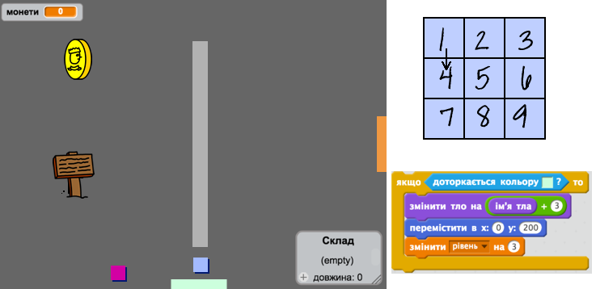

\--- challenge \---

## Challange: розширюйте свій світ

Тепер ви можете продовжувати створювати свій власний світ! Ось деякі ідеї:

+ Змініть налаштування вашої гри та змініть графічні ігри
+ Додайте звуки і музику до своєї гри
+ Додати більше людей, ворогів, знаків та монет
+ Додайте червоні та жовті двері, а також спеціальні ключі, щоб відкрити їх
+ Додайте більше кімнат до вашого світу
+ Додайте інші корисні елементи у свою гру

+ Використовуйте монети, щоб отримати інформацію від інших людей:

+ Ви навіть можете додати двері на північ та південь стін кімнати 1, щоб гравець міг рухатися між приміщеннями у всіх чотирьох напрямках. Наприклад, якщо у вас було б дев'ять кімнат, ви могли б придумати що вони у сітці 3×3. Потім можна додати ` 3 ` до номера кімнати, щоб рухатися вниз на один рівень.

\--- /challenge \---